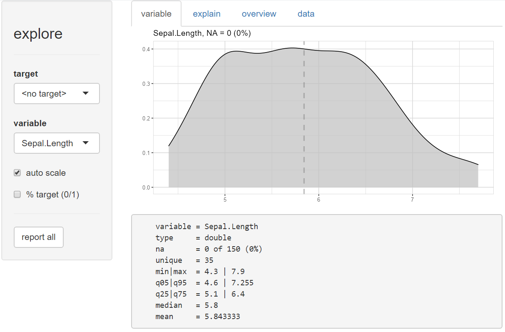
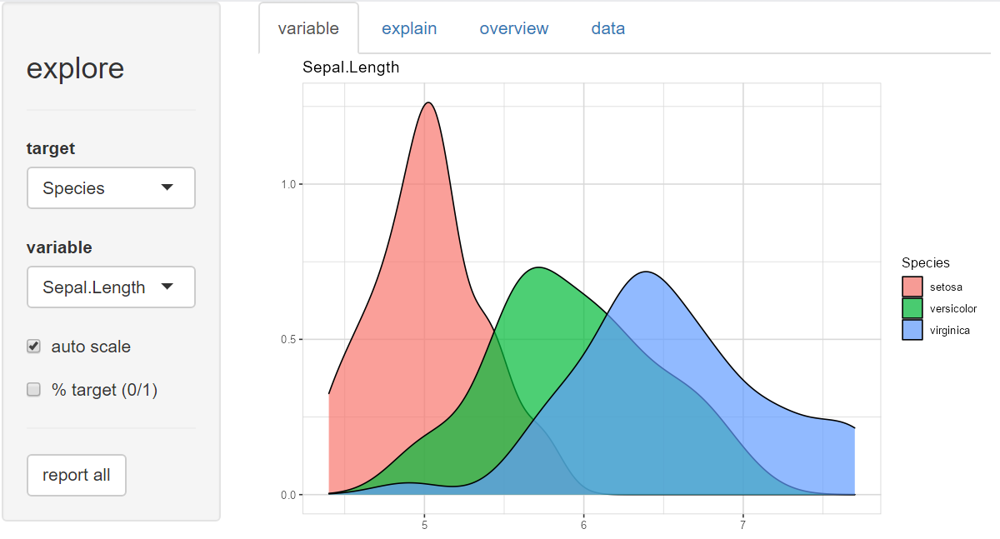
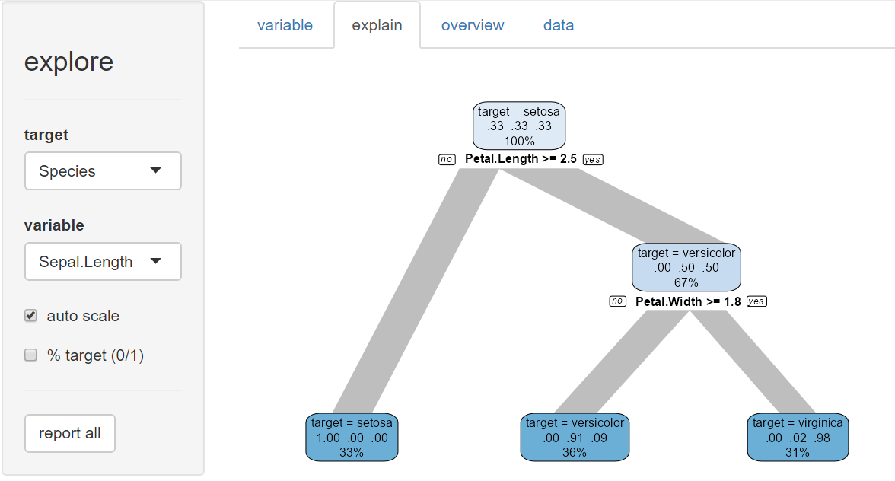
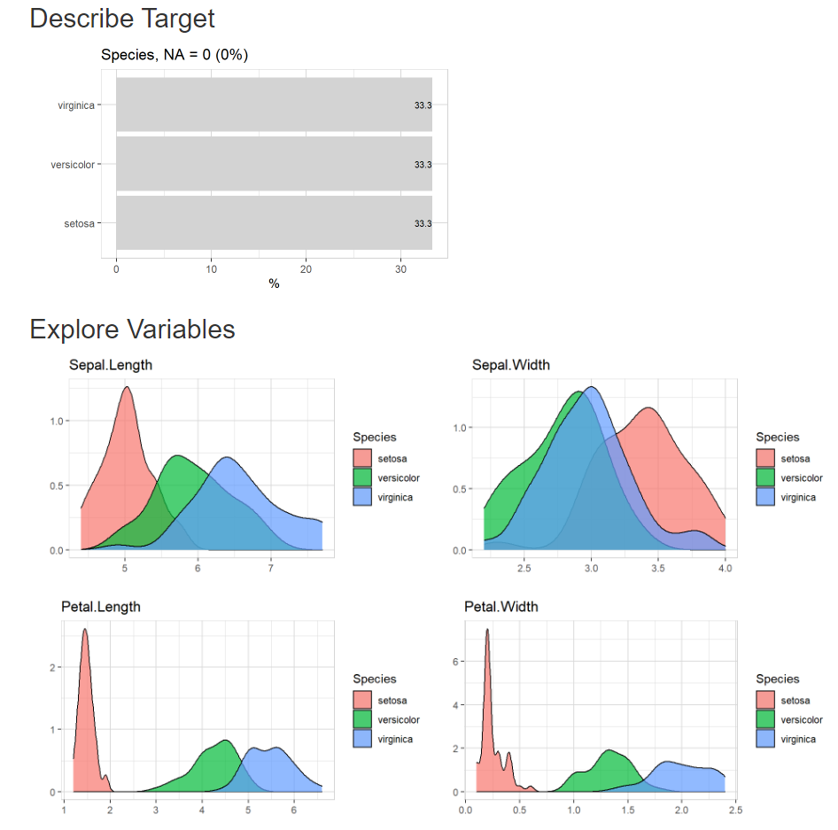

# explore  

  <!-- badges: start -->
  [](https://github.com/rolkra/explore/actions/workflows/R-CMD-check.yaml)
  [](https://cran.r-project.org/package=explore)
  [](https://cran.r-project.org/package=explore)
  [](https://cran.r-project.org/package=explore)
  <!-- badges: end -->


Simplifies Exploratory Data Analysis. 

## Why this package?

* **Faster insights with less code** for experienced R users. Exploring a fresh new dataset is exciting. Instead of searching for syntax at Stackoverflow, use all your attention searching for interesting patterns in your data, using just a handful easy to remember functions. Your code is easy to understand - even for non R users.

* **Instant success** for new R users. It is said that R has a steep learning curve, especially if you come from a GUI for your statistical analysis. Instead of learning a lot of R syntax before you can explore data, the explore package enables you to have instant success. You can start with just one function - explore() - and learn other R syntax later step by step.

## How to use it

There are three ways to use the package:

* **Interactive data exploration** (univariate, bivariate, multivariate). A target can be defined (binary / categorical / numerical). 

* Generate an **Automated Report** with one line of code. The target can be binary, categorical or numeric.

* **Manual exploration** using a easy to remember set of tidy functions. There are basically four "verbs" to remember:

  * **explore** - if you want to explore a table, a variable or the relationship between a variable and a target (binary, categorical or numeric). The output of these functions is a plot.

  * **describe** - if you want to describe a dataset or a variable (number of na, unique values, ...) The output of these functions is a text.

  * **explain** - to create a simple model that explains a target. explain_tree() for a decision tree, explain_logreg() for a logistic regression.

  * **report** - to generate an automated report of all variables. A target can be defined (binary, categorical or numeric)

The explore package automatically checks if an attribute is categorical or numerical, chooses the best plot-type and handles outliers (autosacling).

You can use {explore} with **tidy data** (each row is an observation) or with **count data** (each row is a group of observations with same attributes, one variable stores the number of observations). To use count data, you need to add the n parameter (variable containing the number of observations). Not all functions support count data.

## Installation

### CRAN
```r
install.packages("explore")
```

### DEV version (github)
```r
# install from github
if (!require(devtools)) install.packages("devtools")
devtools::install_github("rolkra/explore")
```
if you are behind a firewall, you may want to:

* Download and unzip the explore package
* Then install it with devtools::install_local

```r
# install local
if (!require(devtools)) install.packages("devtools")
devtools::install_local(path = <path of local package>, force = TRUE)
```

## Examples

### Interactive data exploration

Example how to use the explore package to explore the iris dataset

```r
# load package
library(explore)

# explore interactive
explore(iris)
```

#### Explore variables



#### Explore variables with target



#### Explain target (Decision Tree)



### Automated Report

Create a report by clicking the "report all" button or use the report() function.
If no target is defined, the report shows all variables. If a target is defined, the report shows the relation between all variables and the target.

Report of all variables
```r
iris |> report(output_dir = tempdir())
```


To create a report that shows all variables in relation to a target, just add the
target parameter

```r
iris |> report(output_dir = tempdir(), target = Species)
```



To create a report with a binary target you can use the parameter targetpct = TRUE
(or split = FALSE)

```r
# define a target (is Species versicolor?)
iris$is_versicolor <- ifelse(iris$Species == "versicolor", 1, 0)
iris$Species <- NULL

# create report
iris |> report(output_dir = tempdir(),
                target = is_versicolor,
                targetpct = TRUE)
```


### Manual exploration

Example how to use the functions of the explore package to explore tidy data (each row is an observation) like the iris dataset:

```r
# load packages
library(explore)

# use iris dataset
data(iris)

# explore Species
iris |> explore(Species)

# explore Sepal.Length
iris |> explore(Sepal.Length)

# define a target (is Species versicolor?)
iris$is_versicolor <- ifelse(iris$Species == "versicolor", 1, 0)

# explore relationship between Sepal.Length and the target
iris |> explore(Sepal.Length, target = is_versicolor)

# explore relationship between all variables and the target
iris |> explore_all(target = is_versicolor)

# explore correlation between Sepal.Length and Petal.Length
iris |> explore(Sepal.Length, Petal.Length)

# explore correlation between Sepal.Length, Petal.Length and a target
iris |> explore(Sepal.Length, Petal.Length, target = is_versicolor)

# describe dataset
describe(iris)

# describe Species
iris |> describe(Species)

# explain target using a decision tree
iris$Species <- NULL
iris |> explain_tree(target = is_versicolor)

# explain target using a logistic regression
iris |> explain_logreg(target = is_versicolor)
```

Example how to use the functions of the explore package to explore count-data (each row is a group of observations):


```r
# load packages
library(tibble)
library(explore)

# use titanic dataset
# n = number of observations
titanic <- as_tibble(Titanic)

# describe data
describe(titanic)

# describe Class
titanic |> describe(Class, n = n)

# explore Class
titanic |> explore(Class, n = n)

# explore relationship between Class and the target
titanic |> explore(Class, n = n, target = Survived)

# explore relationship between all variables and the target
titanic |> explore_all(n = n, target = Survived)

# explain target using a decision tree
titanic |> explain_tree(n = n, target = Survived)

```

Some other useful functions:

```r
# create dataset and explore it
data <- create_data_app(obs = 1000)
explore(data)

data <- create_data_buy(obs = 1000)
explore(data)

data <- create_data_churn(obs = 1000)
explore(data)

data <- create_data_person(obs = 1000)
explore(data)

data <- create_data_unfair(obs = 1000)
explore(data)

# create random dataset with 100 observarions and 5 random variables
# and explore it
data <- create_data_random(obs = 100, vars = 5)
explore(data)

# create your own random dataset and explore it
data <- create_data_empty(obs = 1000) |> 
  add_var_random_01("target") |> 
  add_var_random_dbl("age", min_val = 18, max_val = 80) |> 
  add_var_random_cat("gender", 
                     cat = c("male", "female", "other"), 
                     prob = c(0.4, 0.4, 0.2)) |> 
  add_var_random_starsign() |> 
  add_var_random_moon()
  
explore(data)

# create an RMarkdown template to explore your own data
# set output_dir (existing file may be overwritten)
create_notebook_explore(
  output_dir = tempdir(),
  output_file = "notebook-explore.Rmd")

```
