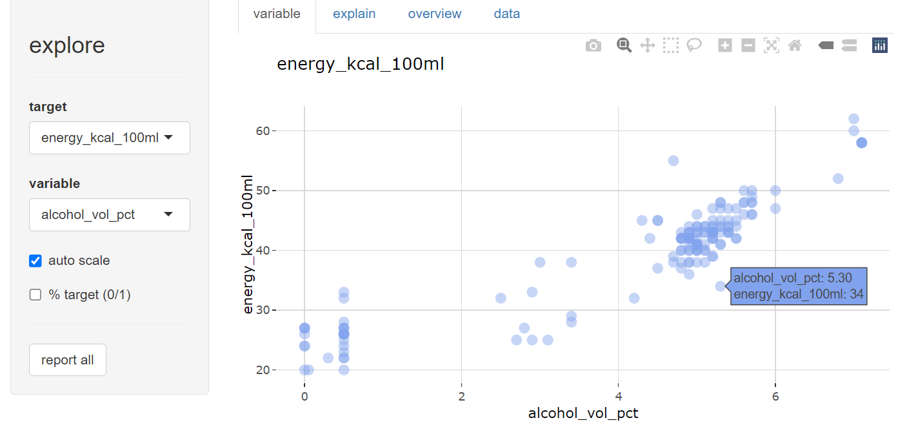
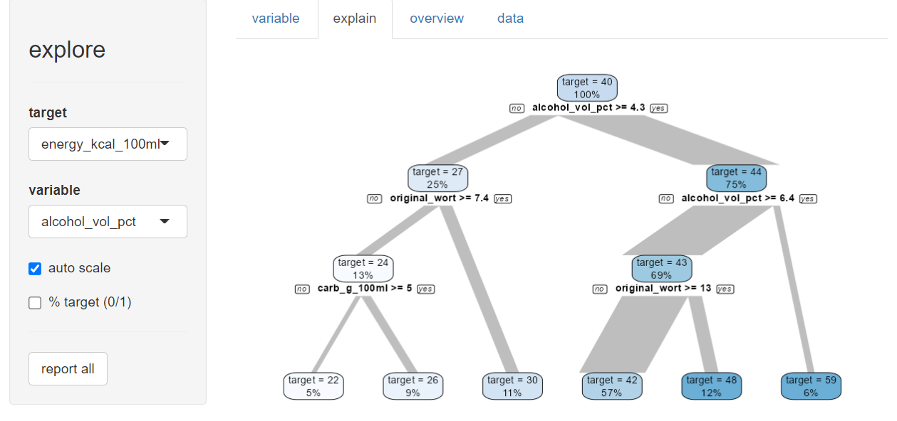
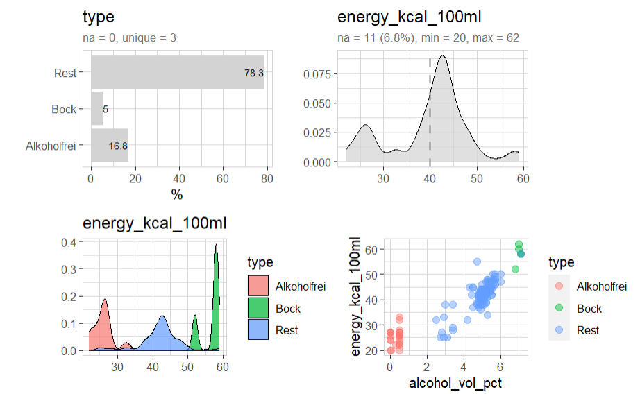

# explore 

<!-- badges: start -->

[](https://github.com/rolkra/explore/actions/workflows/R-CMD-check.yaml) [](https://cran.r-project.org/package=explore)

<!-- badges: end -->

Simplifies Exploratory Data Analysis:

-   **Interactive data exploration** using `explore()`
-   Generate an **automated report** of your data (or patterns in your data) using `report()`
-   **Manual exploration** using `explore()`, `describe()`, `explain_*()`, `abtest()`, ...

``` r
# install from CRAN
install.packages("explore")
```

## Examples

``` r
# interactive data exploration
library(explore)
beer <- use_data_beer()
beer |> explore()
```





``` r
# describe data
beer |> describe()
```

```         
# A tibble: 11 × 8
   variable          type     na na_pct unique    min    mean    max
   <chr>             <chr> <int>  <dbl>  <int>  <dbl>   <dbl>  <dbl>
 1 name              chr       0    0      161   NA     NA      NA  
 2 brand             chr       0    0       29   NA     NA      NA  
 3 country           chr       0    0        3   NA     NA      NA  
 4 year              dbl       0    0        1 2023   2023    2023  
 5 type              chr       0    0        3   NA     NA      NA  
 6 color_dark        dbl       0    0        2    0      0.09    1  
 7 alcohol_vol_pct   dbl       2    1.2     35    0      4.32    8.4
 8 original_wort     dbl       5    3.1     54    5.1   11.3    18.3
 9 energy_kcal_100ml dbl      11    6.8     34   20     39.9    62  
10 carb_g_100ml      dbl      16    9.9     44    1.5    3.53    6.7
11 sugar_g_100ml     dbl      16    9.9     26    0      0.72    4.6
```

``` r
# explore data manually
beer |> explore(type)
beer |> explore(energy_kcal_100ml)
beer |> explore(energy_kcal_100ml, target = type)
beer |> explore(alcohol_vol_pct, energy_kcal_100ml, target = type)
```



``` r
# explore manually with color and interactive
beer |> 
  explore(sugar_g_100ml, color = "gold") |> 
  interact()
```


## Get started

* [Get started with {explore}](https://rolkra.github.io/explore/articles/explore.html)
* [Explore penguins (tidy-data)](https://rolkra.github.io/explore/articles/explore_penguins.html)
* [Explore titanic (count-data)](https://rolkra.github.io/explore/articles/explore_titanic.html)
* [Explain a target using machine learning](https://rolkra.github.io/explore/articles/explain.html)
* [Generate a report of all variables in the  data](https://rolkra.github.io/explore/articles/report.html)
* [Generate a report of all patterns in the  data](https://rolkra.github.io/explore/articles/report-target.html)
* [Datasets in {explore}](https://rolkra.github.io/explore/articles/data.html)
* [A/B testing](https://rolkra.github.io/explore/articles/abtest.html)
* and more ...
