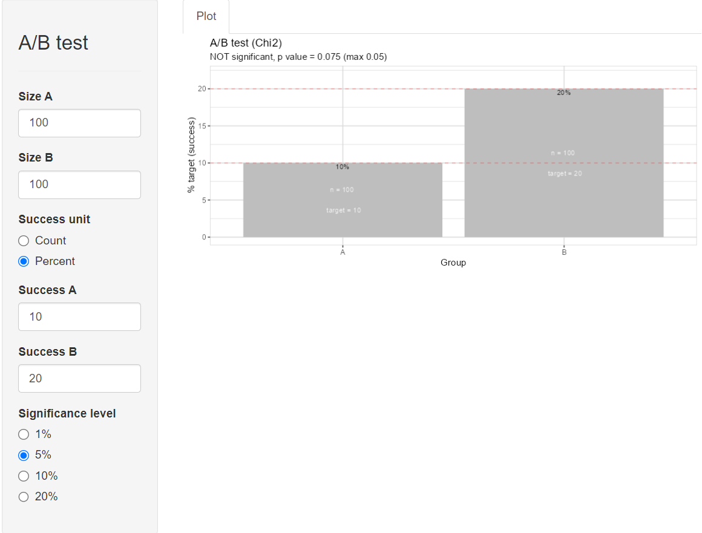
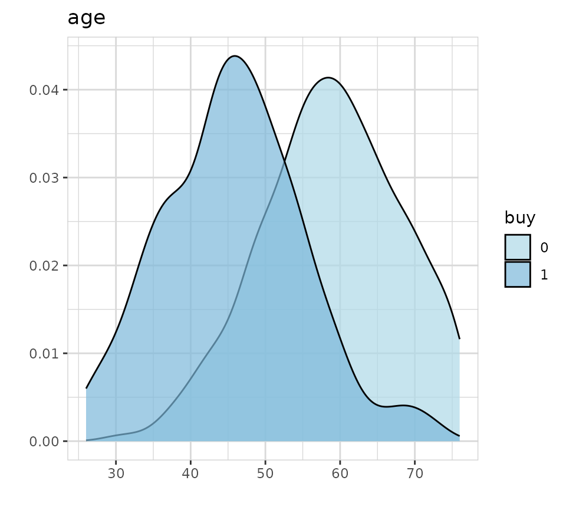
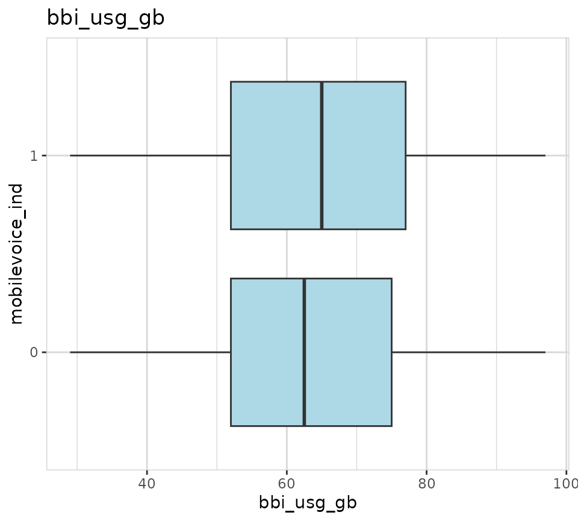

# A/B test

The explore package offers an easy way to do basic A/B testing.

### Interactive A/B testing

For interactive A/B testing simply call
[`abtest()`](../reference/abtest.md) without any parameters.



### A/B testing with tidy data

If you want to A/B test your own data, pass them into the ´abtest()´
function.

In this example we are using synthetic data using one of the
`create_data_()` functions of
[explore](https://rolkra.github.io/explore/)

``` r
library(dplyr)
library(explore)
data <- create_data_buy(obs = 1000)
```

#### Describe dataset

``` r
data %>% describe()
#> # A tibble: 13 × 8
#>    variable        type     na na_pct unique    min      mean    max
#>    <chr>           <chr> <int>  <dbl>  <int>  <dbl>     <dbl>  <dbl>
#>  1 period          int       0      0      1 202012 202012    202012
#>  2 buy             int       0      0      2      0      0.51      1
#>  3 age             int       0      0     66     17     52.3      88
#>  4 city_ind        int       0      0      2      0      0.5       1
#>  5 female_ind      int       0      0      2      0      0.5       1
#>  6 fixedvoice_ind  int       0      0      2      0      0.11      1
#>  7 fixeddata_ind   int       0      0      1      1      1         1
#>  8 fixedtv_ind     int       0      0      2      0      0.4       1
#>  9 mobilevoice_ind int       0      0      2      0      0.63      1
#> 10 mobiledata_prd  chr       0      0      3     NA     NA        NA
#> 11 bbi_speed_ind   int       0      0      2      0      0.61      1
#> 12 bbi_usg_gb      int       0      0     83      9    164.   100000
#> 13 hh_single       int       0      0      2      0      0.37      1
```

Each observation is a customer. The ´buy´ variable contains 0/1 values
(1 = the customer did buy a product)

#### Hypothesis age \> 50

We want to test the hypothesis, that customer with age \> 50 have a
different buying behavior.

``` r
data %>% explore(age, target = buy)
```



We see a clear pattern, that people who buy differ in age from people
who don´t buy. But is this difference statistically significant?

``` r
data %>% abtest(age > 50, target = buy, sign_level = 0.05)
```


The A/B test shows a statistically significant difference!

#### Hypothesis Mobile Voice vs Broadband Usage

We would like to test the hypothesis, that customer with a mobile voice
product (mobilevoice_ind == 1) have different bbi_usg_gb (broadband
usage in GB)

``` r
data %>% explore(mobilevoice_ind, target = bbi_usg_gb)
```



The boxplot shows a small difference in Broadband Usage between
customers with/without Mobile Voice product. But is this difference
statistically significant?

``` r
data %>% abtest(mobilevoice_ind == 1, target = bbi_usg_gb, sign_level = 0.05)
```


The A/B test shows a NOT statistically significant difference! The
p-value is 0.09, but should be max. 0.05 (as we defined sign_level =
0.05)

### A/B testing with count data

In this example we are using the Titanic datasst.
[`use_data_titanic()`](../reference/use_data_titanic.md) is a functions
of [explore](https://rolkra.github.io/explore/) that makes it easier to
use popular example datasets.

``` r
library(dplyr)
library(explore)
data <- use_data_titanic(count = TRUE)
```

#### Describe dataset

``` r
data %>% describe()
#> # A tibble: 5 × 8
#>   variable type     na na_pct unique   min  mean   max
#>   <chr>    <chr> <int>  <dbl>  <int> <dbl> <dbl> <dbl>
#> 1 Class    chr       0      0      4    NA  NA      NA
#> 2 Sex      chr       0      0      2    NA  NA      NA
#> 3 Age      chr       0      0      2    NA  NA      NA
#> 4 Survived chr       0      0      2    NA  NA      NA
#> 5 n        dbl       0      0     22     0  68.8   670
```

#### Hypothesis Female

We want to test the hypothesis, that female passengers have a higher
chance to survive.

``` r
data %>% explore(Sex, target = Survived, n = n)
```


We see a clear pattern, but is it difference statistically significant?

``` r
data %>% abtest(Sex == "Female", target = Survived, n = n, sign_level = 0.05)
```


The A/B test shows a statistically significant difference!

### A/B testing manual

Let’s say you have the results of an experiment and you want to test for
statistical significance using code:

``` r
create_data_abtest(
  n_a = 1000, n_b = 1000,
  success_a = 120, success_b = 210,
  success_unit = "count") %>% 
abtest(sign_level = 0.05)
```


``` r
create_data_abtest(
  n_a = 1000, n_b = 1000,
  success_a = 12, success_b = 21,
  success_unit = "percent") %>% 
abtest(sign_level = 0.05)
```


