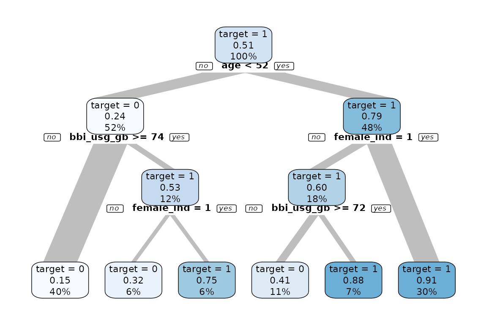
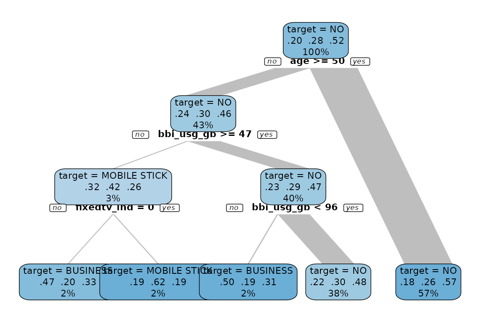
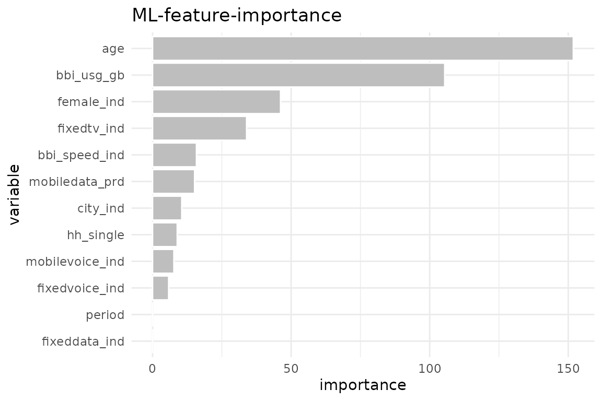
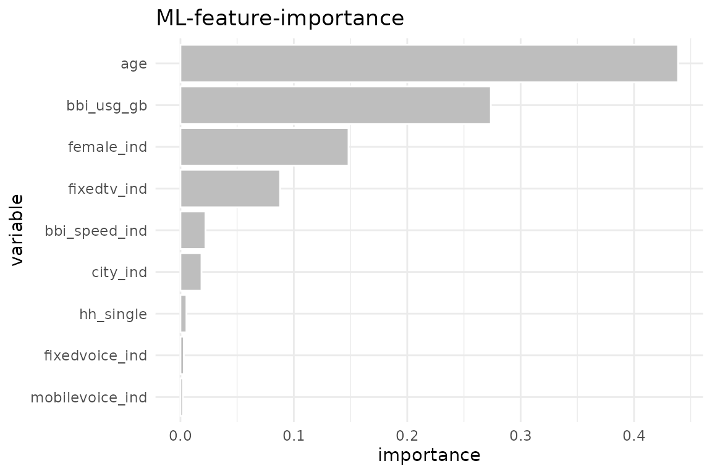

# Explain

The explore package offers a simplified way to use machine learning to
understand and explain patterns in the data.

- [`explain_tree()`](../reference/explain_tree.md) creates a decision
  tree. The target can be binary, categorical or numerical
- [`explain_forest()`](../reference/explain_forest.md) creates a random
  forest. The target can be binary, categorical or numerical
- [`explain_xgboost()`](../reference/explain_xgboost.md) creates a
  random forest. The target must be binary (0/1, FALSE/TRUE)
- [`explain_logreg()`](../reference/explain_logreg.md) creates a
  logistic regression. The target must be binary
- [`balance_target()`](../reference/balance_target.md) to balance a
  target
- [`weight_target()`](../reference/weight_target.md) to create weights
  for the decision tree

We use synthetic data in this example

``` r
library(dplyr)
library(explore)

data <- create_data_buy(obs = 1000)
glimpse(data)
#> Rows: 1,000
#> Columns: 13
#> $ period          <int> 202012, 202012, 202012, 202012, 202012, 202012, 202012…
#> $ buy             <int> 1, 0, 1, 0, 0, 1, 0, 0, 0, 1, 0, 1, 0, 0, 1, 0, 1, 1, …
#> $ age             <int> 39, 57, 55, 66, 71, 44, 64, 51, 70, 44, 58, 47, 68, 71…
#> $ city_ind        <int> 1, 0, 0, 0, 0, 1, 0, 1, 1, 1, 0, 0, 1, 1, 0, 1, 1, 1, …
#> $ female_ind      <int> 0, 0, 1, 0, 1, 0, 0, 0, 0, 1, 1, 0, 0, 0, 1, 0, 1, 0, …
#> $ fixedvoice_ind  <int> 0, 0, 0, 0, 0, 0, 0, 0, 0, 0, 0, 0, 0, 1, 0, 0, 0, 0, …
#> $ fixeddata_ind   <int> 1, 1, 1, 1, 1, 1, 1, 1, 1, 1, 1, 1, 1, 1, 1, 1, 1, 1, …
#> $ fixedtv_ind     <int> 1, 0, 1, 1, 0, 1, 0, 1, 0, 1, 0, 1, 0, 0, 1, 1, 1, 0, …
#> $ mobilevoice_ind <int> 0, 1, 1, 0, 0, 1, 0, 1, 1, 1, 0, 1, 0, 1, 1, 1, 0, 0, …
#> $ mobiledata_prd  <chr> "NO", "NO", "MOBILE STICK", "NO", "BUSINESS", "BUSINES…
#> $ bbi_speed_ind   <int> 1, 1, 0, 1, 0, 1, 0, 1, 0, 1, 1, 1, 0, 0, 1, 0, 0, 1, …
#> $ bbi_usg_gb      <int> 77, 49, 53, 44, 55, 93, 50, 64, 63, 87, 45, 45, 70, 79…
#> $ hh_single       <int> 0, 0, 0, 0, 0, 0, 0, 1, 1, 1, 0, 0, 1, 0, 0, 0, 0, 1, …
```

### Explain / Model

#### Decision Tree

``` r
data %>% explain_tree(target = buy)
```



``` r
data %>% explain_tree(target = mobiledata_prd)
```



``` r
data %>% explain_tree(target = age)
```


#### Random Forest

``` r
data %>% explain_forest(target = buy, ntree = 100)
```



To get the model itself as output you can use the parameter
`out = "model` or `out = all` to get all (feature importance as plot and
table, trained model). To use the model for a prediction, you can use
[`predict_target()`](../reference/predict_target.md)

#### XGBoost

As XGBoost only accepts numeric variables, we use
[`drop_var_not_numeric()`](../reference/drop_var_not_numeric.md) to drop
`mobile_data_prd` as it is not a numeric variable. An alternative would
be to convert the non numeric variables into numeric.

``` r
data %>%
  drop_var_not_numeric() |> 
  explain_xgboost(target = buy)
```



Use parameter `out = "all"` to get more details about the training

``` r
train <- data %>%
  drop_var_not_numeric() |> 
  explain_xgboost(target = buy, out = "all")
```

``` r
train$importance
#>           variable        gain       cover  frequency  importance
#>             <char>       <num>       <num>      <num>       <num>
#> 1:             age 0.438876299 0.269718075 0.22916667 0.438876299
#> 2:      bbi_usg_gb 0.273748159 0.309418667 0.31250000 0.273748159
#> 3:      female_ind 0.148257511 0.145936389 0.13095238 0.148257511
#> 4:     fixedtv_ind 0.087929677 0.126867898 0.12500000 0.087929677
#> 5:   bbi_speed_ind 0.022082803 0.057552002 0.07440476 0.022082803
#> 6:        city_ind 0.018582321 0.064343469 0.06845238 0.018582321
#> 7:       hh_single 0.005310378 0.010887744 0.02083333 0.005310378
#> 8:  fixedvoice_ind 0.003014397 0.008814722 0.02083333 0.003014397
#> 9: mobilevoice_ind 0.002198457 0.006461034 0.01785714 0.002198457
```

``` r
train$tune_plot
```


``` r
train$tune_data
#>    model_nr   eta max_depth    runtime  iter train_auc_mean test_auc_mean
#>       <int> <num>     <num> <difftime> <num>          <num>         <num>
#> 1:        1  0.30         3     0 mins    21      0.9599662     0.9259773
#> 2:        2  0.10         3     0 mins    52      0.9572578     0.9271735
#> 3:        3  0.01         3     0 mins   551      0.9592901     0.9268295
#> 4:        4  0.30         5     0 mins    13      0.9762086     0.9212647
#> 5:        5  0.10         5     0 mins    38      0.9773647     0.9258133
#> 6:        6  0.01         5     0 mins    71      0.9601223     0.9256453
```

To use the model for a prediction, you can use
[`predict_target()`](../reference/predict_target.md)

#### Logistic Regression

``` r
data %>% explain_logreg(target = buy)
#> # A tibble: 6 × 5
#>   term          estimate std.error statistic  p.value
#>   <chr>            <dbl>     <dbl>     <dbl>    <dbl>
#> 1 (Intercept)  5.87      0.544        10.8   3.88e-27
#> 2 age         -0.146     0.0106      -13.8   3.49e-43
#> 3 city_ind     0.711     0.183         3.89  1.02e- 4
#> 4 female_ind   1.75      0.186         9.38  6.91e-21
#> 5 fixedtv_ind  1.51      0.190         7.93  2.14e-15
#> 6 bbi_usg_gb  -0.0000724 0.0000904    -0.801 4.23e- 1
```

### Balance Target

If you have a data set with a very unbalanced target (in this case only
5% of all observations have `buy == 1`) it may be difficult to create a
decision tree.

``` r
data <- create_data_buy(obs = 2000, target1_prob = 0.05)
data %>% describe(buy)
#> variable = buy
#> type     = integer
#> na       = 0 of 2 000 (0%)
#> unique   = 2
#>        0 = 1 899 (95%)
#>        1 = 101 (5.1%)
```

It may help to balance the target before growing the decision tree (or
use weighs as alternative). In this example we down sample the data so
buy has 10% of `target == 1`.

``` r
data %>%
  balance_target(target = buy, min_prop = 0.10) %>%
  explain_tree(target = buy)
```


