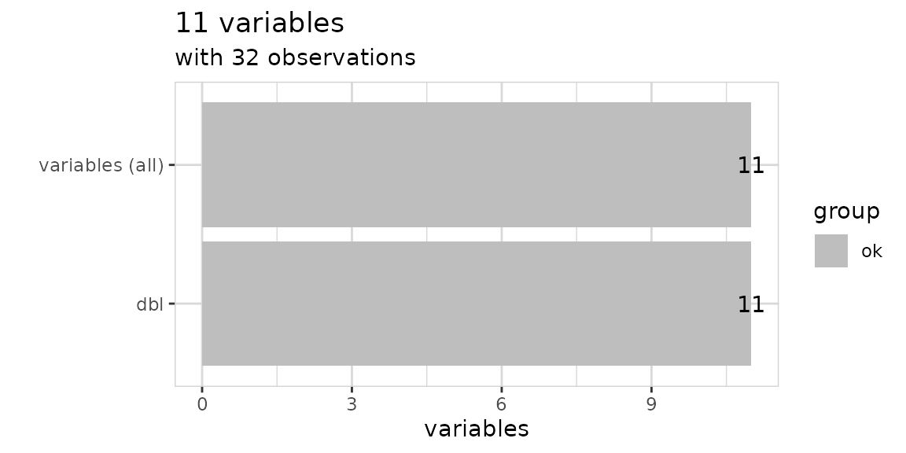
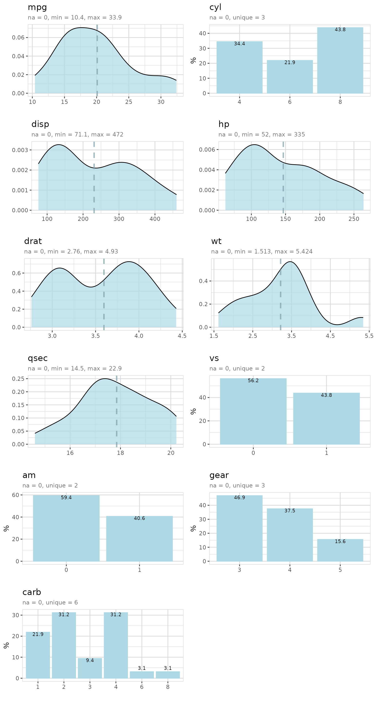
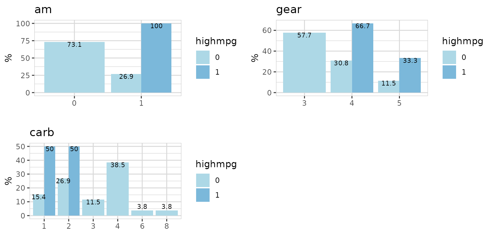
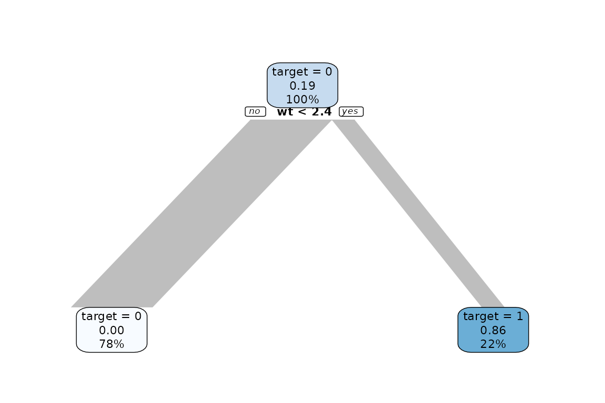
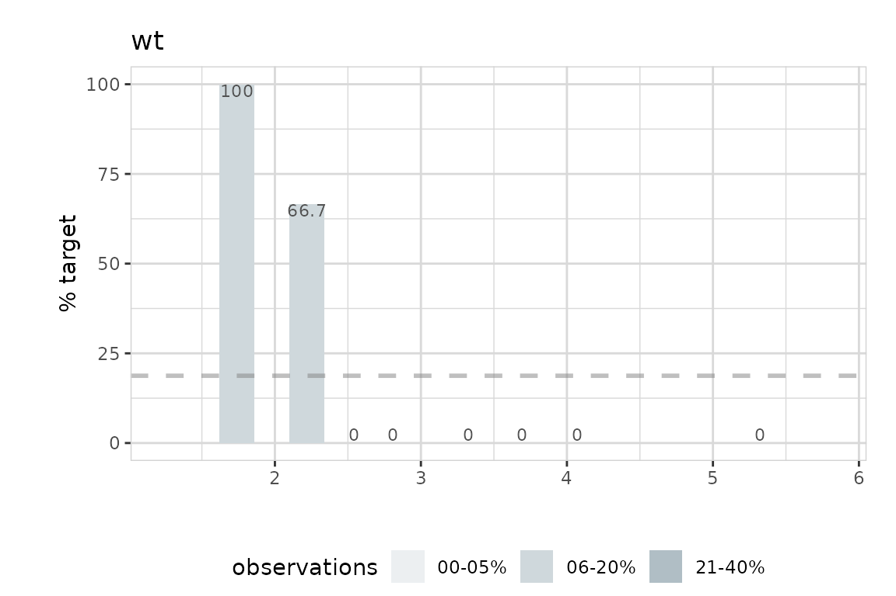

# Explore mtcars

## How to explore the mtcars dataset using the explore package.

The explore package simplifies Exploratory Data Analysis (EDA). Get
faster insights with less code!

The mtcars dataset comes with the dplyr package. We use the packages
explore and dplyr (for `mtcars`,
[`select()`](https://dplyr.tidyverse.org/reference/select.html),
[`mutate()`](https://dplyr.tidyverse.org/reference/mutate.html) and
the`%>%` operator).

``` r
library(dplyr)
library(explore)
```

### Explore dataset

``` r
mtcars %>% explore_tbl()
```



``` r
mtcars %>% describe()
#> # A tibble: 11 × 8
#>    variable type     na na_pct unique   min   mean    max
#>    <chr>    <chr> <int>  <dbl>  <int> <dbl>  <dbl>  <dbl>
#>  1 mpg      dbl       0      0     25 10.4   20.1   33.9 
#>  2 cyl      dbl       0      0      3  4      6.19   8   
#>  3 disp     dbl       0      0     27 71.1  231.   472   
#>  4 hp       dbl       0      0     22 52    147.   335   
#>  5 drat     dbl       0      0     22  2.76   3.6    4.93
#>  6 wt       dbl       0      0     29  1.51   3.22   5.42
#>  7 qsec     dbl       0      0     30 14.5   17.8   22.9 
#>  8 vs       dbl       0      0      2  0      0.44   1   
#>  9 am       dbl       0      0      2  0      0.41   1   
#> 10 gear     dbl       0      0      3  3      3.69   5   
#> 11 carb     dbl       0      0      6  1      2.81   8
```

The data was extracted from the 1974 Motor Trend US magazine, and
comprises fuel consumption and 10 aspects of automobile design and
performance for 32 automobiles (1973–74 models).

| variable | description                              |
|----------|------------------------------------------|
| mpg      | Miles/(US) gallon                        |
| cyl      | Number of cylinders                      |
| disp     | Displacement (cu.in.)                    |
| hp       | Gross horsepower                         |
| drat     | Rear axle ratio                          |
| wt       | Weight (lb/1000)                         |
| qsec     | 1/4 mile time                            |
| vs       | V/S                                      |
| am       | Transmission (0 = automatic, 1 = manual) |
| gear     | Number of forward gears                  |
| carb     | Number of carburetors                    |

### Explore variables

``` r
mtcars %>% 
  explore_all()
```



### Number of gears?

Is there a difference between cars with 3,4 and 5 gears?

``` r
mtcars %>% 
  explore(gear)
```


Most of the cars in the dataset have 3 or 4 gears. 15.6% have 5 gears.

Now check relation between some of the variables and gear:

``` r
mtcars %>% 
  select(gear, mpg, hp, cyl, am) %>% 
  explore_all(target = gear)
```


We see that 100% of cars with am = 0 (automatic) have 3 gears. All cars
with am = 1 (manual) have 5 gears.

### High miles per gallon?

Let’s define an interesting target: Cars that have mpg (miles per
gallon) \> 25

We copy the data and create a new target variable

``` r
data <- mtcars %>% 
  mutate(highmpg = if_else(mpg > 25, 1, 0, 0)) %>% 
  select(-mpg)

data %>% explore(highmpg)
```


So, about 19% of all cars have mpg \> 25. What else is special about
them?

``` r
data %>% 
  select(highmpg, cyl, disp, hp) %>% 
  explore_all(target = highmpg)
```


``` r
data %>% 
  select(highmpg, drat, wt, qsec, vs) %>% 
  explore_all(target = highmpg)
```


``` r
data %>% 
  select(highmpg, am, gear, carb) %>% 
  explore_all(target = highmpg)
```



There are some strong differences between cars with / without “high
mpg”.

Now let’s grow a decision tree:

``` r
data %>% 
  explain_tree(target = highmpg)
```



Growing a decision tree, shows that there seems to be a very strong
correlation between wt (weight) and “high mpg”. Cars with a low weight
are much more likely to have “high mpg”.

Let’s take a closer look to wt:

``` r
data %>% explore(wt, target = highmpg)
```


``` r
data %>% explore(wt, target = highmpg, split = FALSE)
```



The plot shows the percentage of cars with high mpg. Cars with high mpg
have a weight \< 2.5. So wt (weight) is a good predictor for high mpg.

``` r
mtcars %>% explore(wt, mpg)
```


There is a strong correlation between wt and mpg.

If you want to have high miles per gallon (mpg), buy a car with low
weight (wt)!

### Horsepower?

Is there a relation between horsepower and other variables like number
of cylinder?

Let’s build a decision tree with horsepower as target:

``` r
mtcars %>% 
  explain_tree(target = hp, minsplit=15)
```


All cars have an average hp of 147 (shown in the top node). Then the
data is split by cyl. Cars with cyl\<7 (56% of all cars) have an average
hp of 98 and cars with `cp>=7` (44% of all cars) have an average hp of
209.

The variables cyl and mpg can explain hp. The bottom nodes are showing
an average hp of 80, 121 and 209.

In the tree rounded values are shown. If you want to know the exact
values for each split, you can use the parameter `out = "model"` to get
the model returned and take a look.

``` r
model
#> n= 32 
#> 
#> node), split, n, deviance, yval
#>       * denotes terminal node
#> 
#> 1) root 32 145726.900 146.68750  
#>   2) cyl< 7 18  14638.940  98.05556  
#>     4) mpg>=21.45 10   3618.000  80.00000 *
#>     5) mpg< 21.45 8   3685.875 120.62500 *
#>   3) cyl>=7 14  33782.360 209.21430 *
```

You see that the split for mpg is done at exactly 21.45

Now let’s take a look at the direct correlation the variables used in
the tree and hp:

``` r
mtcars %>% 
  select(hp, cyl, mpg) %>% 
  explore_all(target = hp)
```


Cars with 8 cylinders have higher horsepower.

Cars with low miles per gallon (mpg) have higher horsepower!
