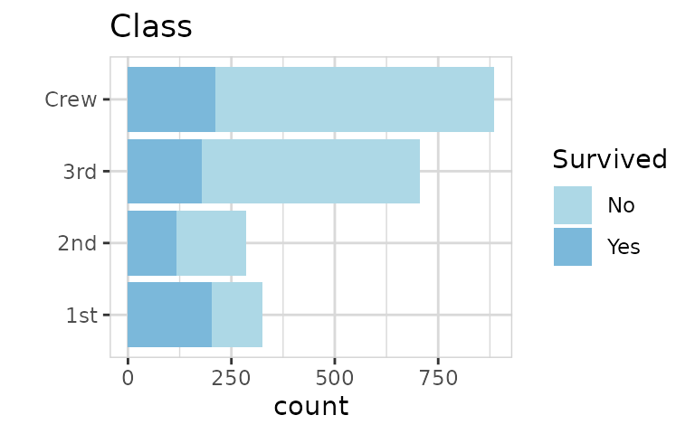
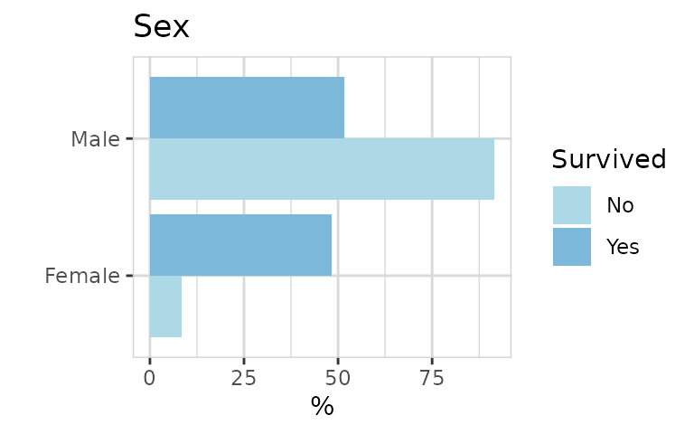

# Explore titanic

## How to explore the Titanic dataset using the explore package.

The explore package simplifies Exploratory Data Analysis (EDA). Get
faster insights with less code!

The titanic dataset is available in base R. The data has 5 variables and
only 32 rows. Each row does NOT represent an observation. It is not
tidy, instead the data set contains Frequencies! And it is not a data
frame, therefore we we need to convert it first.

``` r
library(dplyr)
library(explore)
titanic <- use_data_titanic(count = TRUE)
```

### Explore dataset

``` r
titanic %>% describe_tbl(n = n)
#> 2 201 (2.2k) observations with 5 variables
#> 0 observations containing missings (NA)
#> 0 variables containing missings (NA)
#> 0 variables with no variance
```

``` r
titanic %>% describe()
#> # A tibble: 5 × 8
#>   variable type     na na_pct unique   min  mean   max
#>   <chr>    <chr> <int>  <dbl>  <int> <dbl> <dbl> <dbl>
#> 1 Class    chr       0      0      4    NA  NA      NA
#> 2 Sex      chr       0      0      2    NA  NA      NA
#> 3 Age      chr       0      0      2    NA  NA      NA
#> 4 Survived chr       0      0      2    NA  NA      NA
#> 5 n        dbl       0      0     22     0  68.8   670
```

All variables are categorical except n, representing the number of
observations.

The data look like this:

``` r
titanic %>% head(10)
#> # A tibble: 10 × 5
#>    Class Sex    Age   Survived     n
#>    <chr> <chr>  <chr> <chr>    <dbl>
#>  1 1st   Male   Child No           0
#>  2 2nd   Male   Child No           0
#>  3 3rd   Male   Child No          35
#>  4 Crew  Male   Child No           0
#>  5 1st   Female Child No           0
#>  6 2nd   Female Child No           0
#>  7 3rd   Female Child No          17
#>  8 Crew  Female Child No           0
#>  9 1st   Male   Adult No         118
#> 10 2nd   Male   Adult No         154
```

### Explore variables

As the normal explore() function of the {explore} package expects a tidy
dataset (each row is an observation), we need add the parameter n
(number of observations)

``` r
titanic %>% explore(Class, n = n)
```


We get the exact numbers by using describe() together with the
n-parameter (weight)

``` r
titanic %>% describe(Class, n = n)
#> variable = Class
#> type     = character
#> na       = 0 of 2 201 (0%)
#> unique   = 4
#>  1st     = 325 (14.8%)
#>  2nd     = 285 (12.9%)
#>  3rd     = 706 (32.1%)
#>  Crew    = 885 (40.2%)
```

To explore all variables, we can simply use explore_all(). You
automatically fit the height of the plot using
`fig.height=total_fig_height(titanic, var_name_n = "n")` in the code
chunk header.

``` r
titanic %>% explore_all(n = n)
```


### Survived?

Now we want to check the relation between variables and Survived. We can
use the explore() function with Survived as target.

``` r
titanic %>% explore(Class, target = Survived, n = n, split = FALSE)
```



To get a better feeling of the relationship between Class and Survived,
we switch to percentage and split the target into sperate bars. We can
do that by using split = TRUE (which is default).

``` r
titanic %>% explore(Class, target = Survived, n = n, split = TRUE)
```


Now we get a plot, where each color sum to 100%. So a big difference in
bar length indicates an important relationship between the two
variables. In this case, passengers of 1st Class had the highest
probability to survive.

``` r
titanic %>% explore(Sex, target = Survived, n = n)
```



Female are much more likely to survive!

``` r
titanic %>% explore(Age, target = Survived, n = n)
```


Child had an advantage to survive.

Now we can create a simple decision tree. As we have count-data we need
to pass parameter n.

``` r
titanic %>% explain_tree(target = Survived, n = n)
```


We see that Sex and Class can give a good explanation who are more
likely to survive.

- Sex = Male: **21% survived** (79% of all observations)
- Sex = Female & Class = 3rd: **46% survived** (9% of all observations)
- Sex = Female & Class \<\> 3rd: **93% survived** (12% of all
  observations)

### Other correlations

``` r
titanic %>% explore(Age, target = Class, n = n)
```


Child are unlikely in the 1st class! And all Crew members are adult as
expected.

``` r
titanic %>% explore(Sex, target = Class, n = n)
```


Almost no female Crew members! Female tend to have better Class!
