# explore

The explore package simplifies Exploratory Data Analysis (EDA). Get
faster insights with less code!

explore package on Github: <https://github.com/rolkra/explore>

As the explore-functions fits well into the tidyverse, we load the
dplyr-package as well.

``` r
library(dplyr)
library(explore)
```

### Interactive data exploration

Explore your data set (in this case the iris data set) in one line of
code:

``` r
explore(iris)
```

A shiny app is launched, you can inspect individual variable, explore
their relation to a target (binary / categorical / numerical), grow a
decision tree or create a fully automated report of all variables with a
few “mouse clicks”.


You can choose each variable containing as a target, that is binary
(0/1, FALSE/TRUE or “no”/“yes”), categorical or numeric.

### Report variables

Create a rich HTML report of all variables with one line of code:

``` r
# report of all variables
iris %>% report(output_file = "report.html", output_dir = tempdir())
```

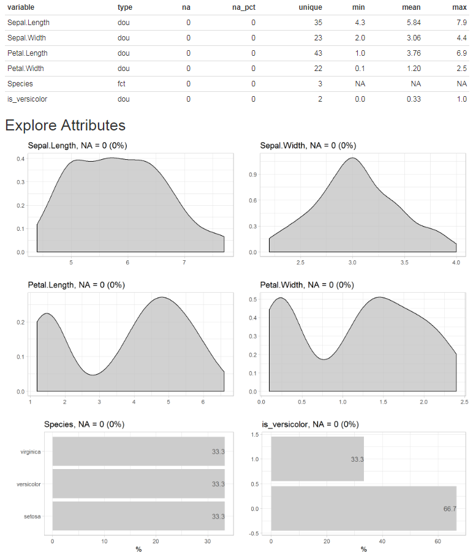

Or you can simply add a target and create the report. In this case we
use a binary target, but a categorical or numerical target would work as
well.

``` r
# report of all variables and their relationship with a binary target
iris$is_versicolor <- ifelse(iris$Species == "versicolor", 1, 0)
iris %>% 
  report(output_file = "report.html", 
         output_dir = tempdir(),
         target = is_versicolor)
```

If you use a binary target, the parameter ***split = FALSE*** (or
`targetpct = TRUE`) will give you a different view on the data.


### Grow a decision tree

Grow a decision tree with one line of code:

``` r
iris %>% explain_tree(target = Species)
```


You can grow a decision tree with a binary target too.

``` r
iris$is_versicolor <- ifelse(iris$Species == "versicolor", 1, 0)
iris %>% select(-Species) %>% explain_tree(target = is_versicolor)
```

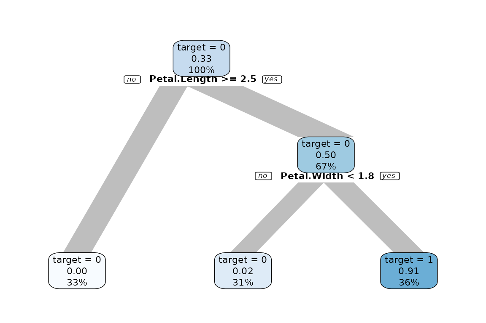

Or using a numerical target. The syntax stays the same.

``` r
iris %>% explain_tree(target = Sepal.Length)
```


You can control the growth of the tree using the parameters `maxdepth`,
`minsplit` and `cp`.

To create other types of models use
[`explain_forest()`](../reference/explain_forest.md),
[`explain_xgboost()`](../reference/explain_xgboost.md) and
[`explain_logreg()`](../reference/explain_logreg.md).

### Explore dataset

Explore your table with one line of code to see which type of variables
it contains.

``` r
iris %>% explore_tbl()
```

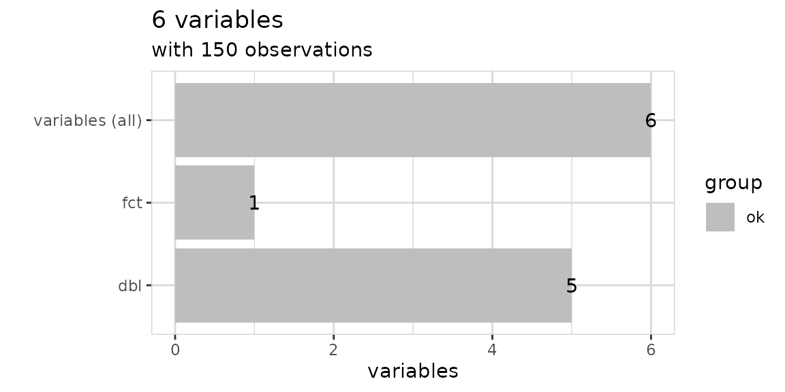

You can also use [`describe_tbl()`](../reference/describe_tbl.md) if you
just need the main facts without visualization.

``` r
iris %>% describe_tbl()
#> 150 observations with 6 variables
#> 0 observations containing missings (NA)
#> 0 variables containing missings (NA)
#> 0 variables with no variance
```

### Explore variables

Explore a variable with one line of code. You don’t have to care if a
variable is numerical or categorical.

``` r
iris %>% explore(Species)
```


``` r
iris %>% explore(Sepal.Length)
```

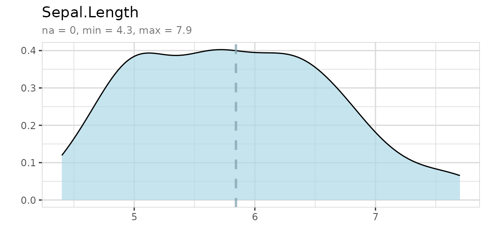

### Explore variables with a target

Explore a variable and its relationship with a binary target with one
line of code. You don’t have to care if a variable is numerical or
categorical.

``` r
iris %>% explore(Sepal.Length, target = is_versicolor)
```


Using split = FALSE will change the plot to %target:

``` r
iris %>% explore(Sepal.Length, target = is_versicolor, split = FALSE)
```


The target can have more than two levels:

``` r
iris %>% explore(Sepal.Length, target = Species)
```


Or the target can even be numeric:

``` r
iris %>% explore(Sepal.Length, target = Petal.Length)
```

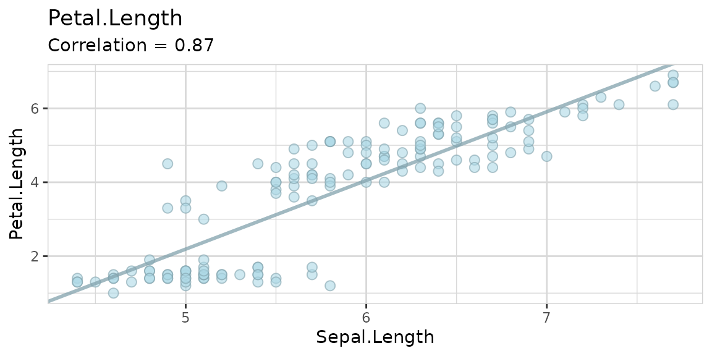

### Explore multiple variables

``` r
iris %>% 
  select(Sepal.Length, Sepal.Width) %>% 
  explore_all()
```

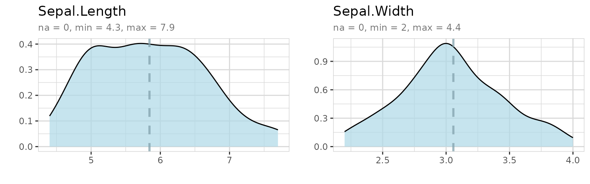

``` r
iris %>% 
  select(Sepal.Length, Sepal.Width, is_versicolor) %>% 
  explore_all(target = is_versicolor)
```


``` r
iris %>% 
  select(Sepal.Length, Sepal.Width, is_versicolor) %>% 
  explore_all(target = is_versicolor, split = FALSE)
```

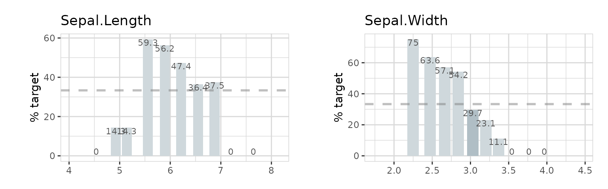

``` r
iris %>% 
  select(Sepal.Length, Sepal.Width, Species) %>% 
  explore_all(target = Species)
```

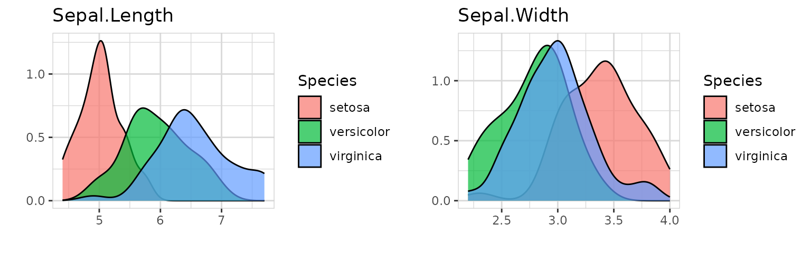

``` r
iris %>% 
  select(Sepal.Length, Petal.Width, Petal.Length) %>% 
  explore_all(target = Petal.Length)
```


``` r
data(iris)
```

To use a high number of variables with
[`explore_all()`](../reference/explore_all.md) in a RMarkdown-File, it
is necessary to set a meaningful fig.width and fig.height in the junk.
The function [`total_fig_height()`](../reference/total_fig_height.md)
helps to automatically set fig.height:
`fig.height=total_fig_height(iris)`

``` r
iris %>% 
  explore_all()
```

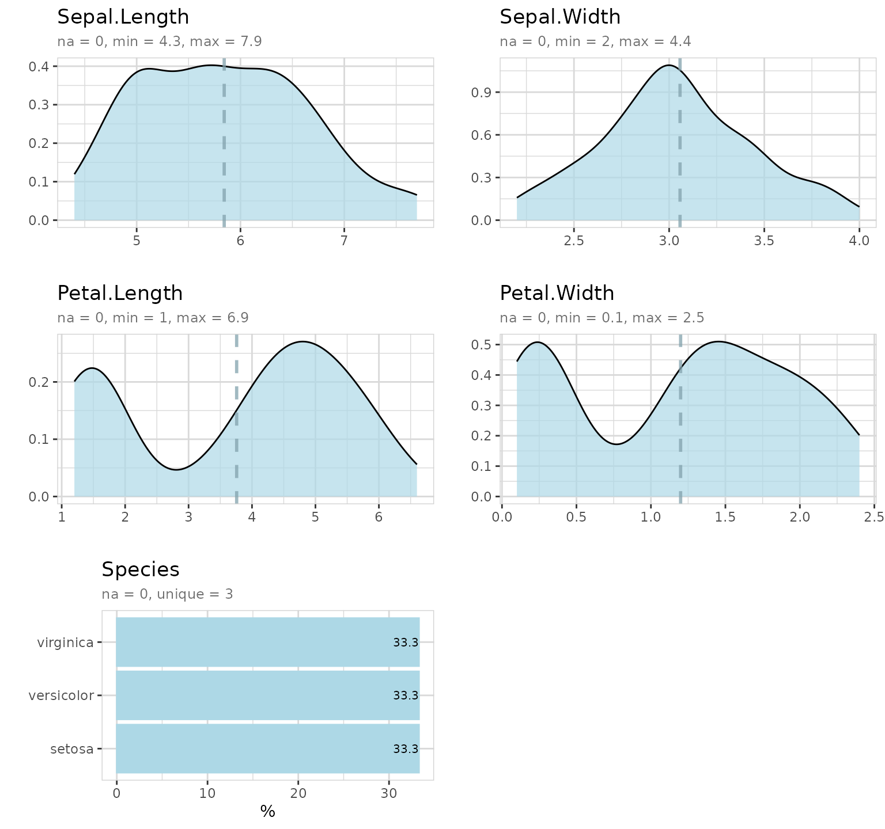

If you use a target:
`fig.height=total_fig_height(iris, var_name_target = "Species")`

``` r
iris %>% explore_all(target = Species)
```


You can control total_fig_height() by parameters ncols (number of
columns of the plots) and size (height of 1 plot)

### Explore correlation between two variables

Explore correlation between two variables with one line of code:

``` r
iris %>% explore(Sepal.Length, Petal.Length)
```


You can add a target too:

``` r
iris %>% explore(Sepal.Length, Petal.Length, target = Species)
```


### Explore options

If you use explore to explore a variable and want to set lower and upper
limits for values, you can use the `min_val` and `max_val` parameters.
All values below min_val will be set to min_val. All values above
max_val will be set to max_val.

``` r
iris %>% explore(Sepal.Length, min_val = 4.5, max_val = 7)
```

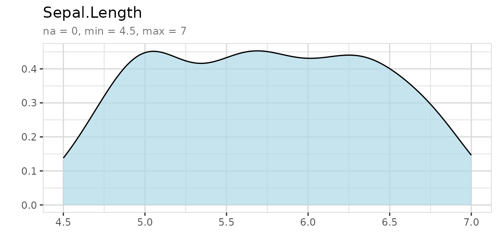

`explore` uses auto-scale by default. To deactivate it use the parameter
`auto_scale = FALSE`

``` r
iris %>% explore(Sepal.Length, auto_scale = FALSE)
```

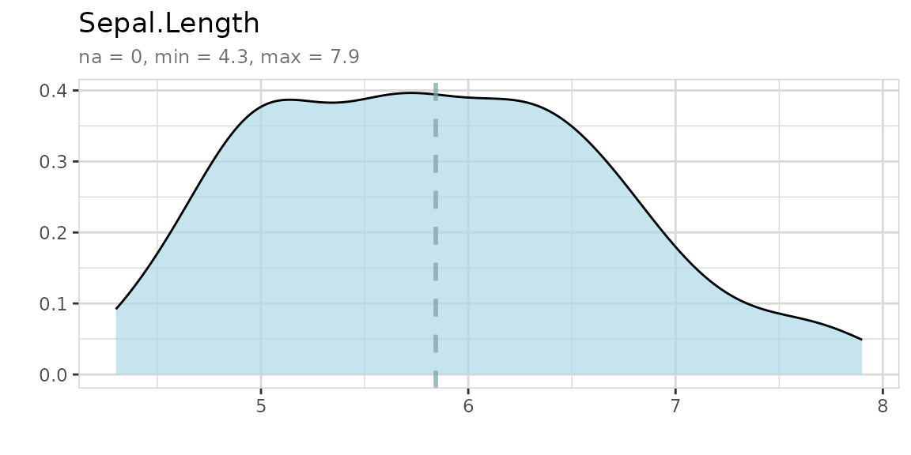

### Describing data

Describe your data in one line of code:

``` r
iris %>% describe()
#> # A tibble: 5 × 8
#>   variable     type     na na_pct unique   min  mean   max
#>   <chr>        <chr> <int>  <dbl>  <int> <dbl> <dbl> <dbl>
#> 1 Sepal.Length dbl       0      0     35   4.3  5.84   7.9
#> 2 Sepal.Width  dbl       0      0     23   2    3.06   4.4
#> 3 Petal.Length dbl       0      0     43   1    3.76   6.9
#> 4 Petal.Width  dbl       0      0     22   0.1  1.2    2.5
#> 5 Species      fct       0      0      3  NA   NA     NA
```

The result is a data-frame, where each row is a variable of your data.
You can use `filter` from dplyr for quick checks:

``` r
# show all variables that contain less than 5 unique values
iris %>% describe() %>% filter(unique < 5)
#> # A tibble: 1 × 8
#>   variable type     na na_pct unique   min  mean   max
#>   <chr>    <chr> <int>  <dbl>  <int> <dbl> <dbl> <dbl>
#> 1 Species  fct       0      0      3    NA    NA    NA
```

``` r
# show all variables contain NA values
iris %>% describe() %>% filter(na > 0)
#> # A tibble: 0 × 8
#> # ℹ 8 variables: variable <chr>, type <chr>, na <int>, na_pct <dbl>,
#> #   unique <int>, min <dbl>, mean <dbl>, max <dbl>
```

You can use `describe` for describing variables too. You don’t need to
care if a variale is numerical or categorical. The output is a text.

``` r
# describe a numerical variable
iris %>% describe(Species)
#> variable = Species
#> type     = factor
#> na       = 0 of 150 (0%)
#> unique   = 3
#>  setosa     = 50 (33.3%)
#>  versicolor = 50 (33.3%)
#>  virginica  = 50 (33.3%)
```

``` r
# describe a categorical variable
iris %>% describe(Sepal.Length)
#> variable = Sepal.Length
#> type     = double
#> na       = 0 of 150 (0%)
#> unique   = 35
#> min|max  = 4.3 | 7.9
#> q05|q95  = 4.6 | 7.255
#> q25|q75  = 5.1 | 6.4
#> median   = 5.8
#> mean     = 5.843333
```

### Use data

Use one of the prepared datasets to explore:

- [`use_data_beer()`](../reference/use_data_beer.md)
- [`use_data_diamonds()`](../reference/use_data_diamonds.md)
- [`use_data_iris()`](../reference/use_data_iris.md)
- [`use_data_mpg()`](../reference/use_data_mpg.md)
- [`use_data_mtcars()`](../reference/use_data_mtcars.md)
- [`use_data_penguins()`](../reference/use_data_penguins.md)
- [`use_data_starwars()`](../reference/use_data_starwars.md)
- [`use_data_titanic()`](../reference/use_data_titanic.md)
- [`use_data_wordle()`](../reference/use_data_wordle.md)

``` r
use_data_beer() %>% describe()
#> # A tibble: 11 × 8
#>    variable          type     na na_pct unique    min    mean    max
#>    <chr>             <chr> <int>  <dbl>  <int>  <dbl>   <dbl>  <dbl>
#>  1 name              chr       0    0      161   NA     NA      NA  
#>  2 brand             chr       0    0       29   NA     NA      NA  
#>  3 country           chr       0    0        3   NA     NA      NA  
#>  4 year              dbl       0    0        1 2023   2023    2023  
#>  5 type              chr       0    0        3   NA     NA      NA  
#>  6 color_dark        dbl       0    0        2    0      0.09    1  
#>  7 alcohol_vol_pct   dbl       2    1.2     35    0      4.32    8.4
#>  8 original_wort     dbl       5    3.1     54    5.1   11.3    18.3
#>  9 energy_kcal_100ml dbl      11    6.8     34   20     39.9    62  
#> 10 carb_g_100ml      dbl      16    9.9     44    1.5    3.53    6.7
#> 11 sugar_g_100ml     dbl      16    9.9     26    0      0.72    4.6
```

### Create data

Use one of the prepared datasets to explore:

- [`create_data_abtest()`](../reference/create_data_abtest.md)
- [`create_data_app()`](../reference/create_data_app.md)
- [`create_data_buy()`](../reference/create_data_buy.md)
- [`create_data_churn()`](../reference/create_data_churn.md)
- [`create_data_esoteric()`](../reference/create_data_esoteric.md)
- [`create_data_newsletter()`](../reference/create_data_newsletter.md)
- [`create_data_person()`](../reference/create_data_person.md)
- [`create_data_unfair()`](../reference/create_data_unfair.md)
- [`create_data_random()`](../reference/create_data_random.md)

``` r
# create dataset and describe it
data <- create_data_app(obs = 100)
describe(data)
#> # A tibble: 7 × 8
#>   variable     type     na na_pct unique   min    mean   max
#>   <chr>        <chr> <int>  <dbl>  <int> <dbl>   <dbl> <dbl>
#> 1 os           chr       0      0      3    NA   NA       NA
#> 2 free         int       0      0      2     0    0.62     1
#> 3 downloads    int       0      0     99   255 6704.   18386
#> 4 rating       dbl       0      0      5     1    3.44     5
#> 5 type         chr       0      0     10    NA   NA       NA
#> 6 updates      dbl       0      0     72     1   45.6     99
#> 7 screen_sizes dbl       0      0      5     1    2.61     5
```

``` r
# create dataset and describe it
data <- create_data_random(obs = 100, vars = 5)
describe(data)
#> # A tibble: 7 × 8
#>   variable   type     na na_pct unique   min  mean   max
#>   <chr>      <chr> <int>  <dbl>  <int> <dbl> <dbl> <dbl>
#> 1 id         int       0      0    100     1 50.5    100
#> 2 target_ind int       0      0      2     0  0.53     1
#> 3 var_1      int       0      0     61     1 51.4     99
#> 4 var_2      int       0      0     63     1 48.6     98
#> 5 var_3      int       0      0     62     1 49.2    100
#> 6 var_4      int       0      0     68     0 48.6    100
#> 7 var_5      int       0      0     64     2 51.9     99
```

You can build you own random dataset by using
[`create_data_empty()`](../reference/create_data_empty.md) and
`add_var_random_*()` functions:

``` r
# create dataset and describe it
data <- create_data_empty(obs = 1000) %>% 
  add_var_random_01("target") %>% 
  add_var_random_dbl("age", min_val = 18, max_val = 80) %>% 
  add_var_random_cat("gender", 
                     cat = c("male", "female", "other"), 
                     prob = c(0.4, 0.4, 0.2)) %>% 
  add_var_random_starsign() %>%
  add_var_random_moon()
describe(data)
#> # A tibble: 5 × 8
#>   variable        type     na na_pct unique   min  mean   max
#>   <chr>           <chr> <int>  <dbl>  <int> <dbl> <dbl> <dbl>
#> 1 target          int       0      0      2   0    0.51   1  
#> 2 age             dbl       0      0   1000  18.2 49.1   80.0
#> 3 gender          chr       0      0      3  NA   NA     NA  
#> 4 random_starsign chr       0      0     12  NA   NA     NA  
#> 5 random_moon     chr       0      0      4  NA   NA     NA
```

``` r
data %>% select(random_starsign, random_moon) %>% explore_all()
```


### Basic data cleaning

To clean a variable you can use `clean_var`. With one line of code you
can rename a variable, replace NA-values and set a minimum and maximum
for the value.

``` r
iris %>% 
  clean_var(Sepal.Length, 
            min_val = 4.5, 
            max_val = 7.0, 
            na = 5.8, 
            name = "sepal_length") %>% 
  describe()
#> # A tibble: 5 × 8
#>   variable     type     na na_pct unique   min  mean   max
#>   <chr>        <chr> <int>  <dbl>  <int> <dbl> <dbl> <dbl>
#> 1 sepal_length dbl       0      0     26   4.5  5.81   7  
#> 2 Sepal.Width  dbl       0      0     23   2    3.06   4.4
#> 3 Petal.Length dbl       0      0     43   1    3.76   6.9
#> 4 Petal.Width  dbl       0      0     22   0.1  1.2    2.5
#> 5 Species      fct       0      0      3  NA   NA     NA
```

To drop variables or observations you can use `drop_var_*()` and
`drop_obs_*()` functions.

``` r
use_data_penguins() %>% 
  describe_tbl()
#> 344 observations with 8 variables
#> 11 observations containing missings (NA)
#> 5 variables containing missings (NA)
#> 0 variables with no variance
```

``` r
use_data_penguins() %>%
  drop_obs_with_na() %>%
  describe_tbl()
#> 333 observations with 8 variables
#> 0 observations containing missings (NA)
#> 0 variables containing missings (NA)
#> 0 variables with no variance
```

### Create notebook

Create an RMarkdown template to explore your own data. Set output_dir
(existing file may be overwritten)

``` r
create_notebook_explore(
  output_dir = tempdir(),
  output_file = "notebook-explore.Rmd")
```


