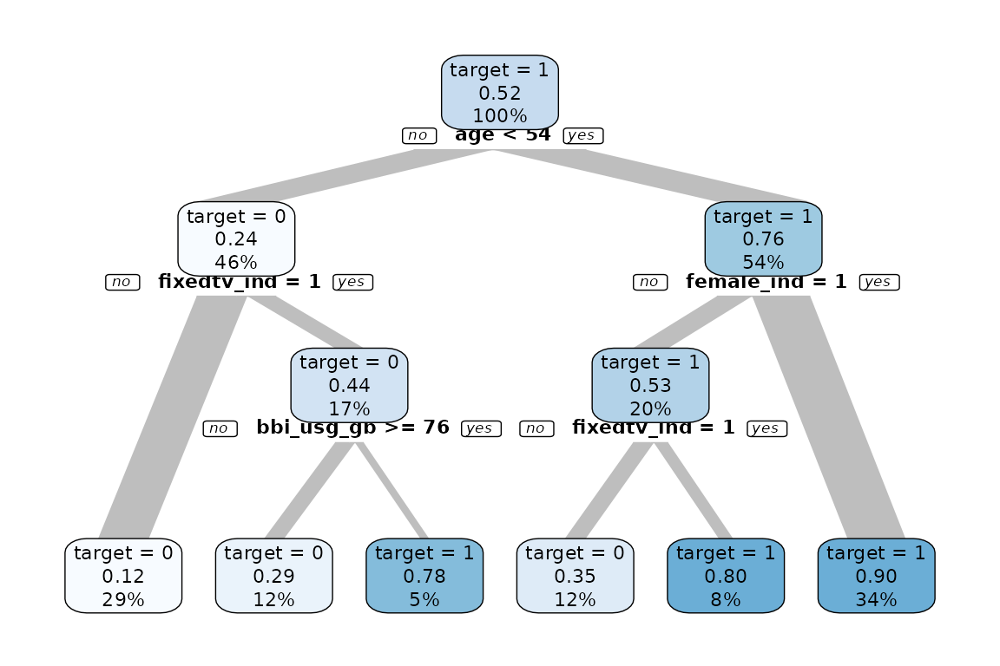
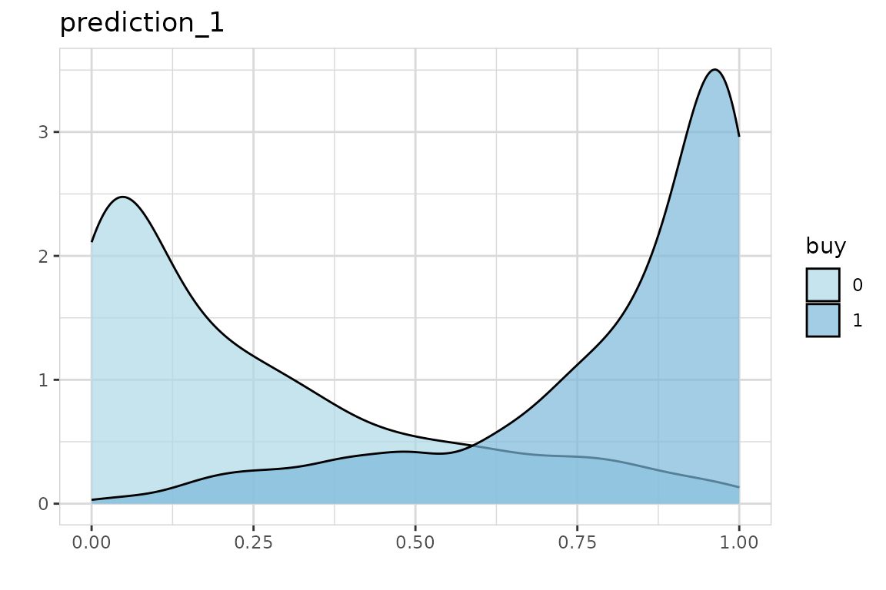

# Predict

The explore package offers a simplified way to use machine learning and
make a prediction.

- [`explain_tree()`](../reference/explain_tree.md) creates a decision
  tree
- [`explain_forest()`](../reference/explain_forest.md) creates a random
  forest
- [`explain_xgboost()`](../reference/explain_xgboost.md) creates a
  xgboost model
- [`explain_logreg()`](../reference/explain_logreg.md) creates a
  logistic regression
- [`predict_target()`](../reference/predict_target.md) uses a model to
  make a prediction

We use synthetic data in this example

``` r
library(dplyr)
library(explore)

train <- create_data_buy(obs = 1000, seed = 1)
glimpse(train)
#> Rows: 1,000
#> Columns: 13
#> $ period          <int> 202012, 202012, 202012, 202012, 202012, 202012, 202012…
#> $ buy             <int> 1, 1, 0, 0, 1, 0, 0, 0, 0, 1, 1, 1, 0, 1, 0, 1, 0, 0, …
#> $ age             <int> 46, 42, 69, 51, 55, 58, 69, 73, 59, 34, 20, 36, 48, 45…
#> $ city_ind        <int> 1, 1, 1, 0, 1, 0, 0, 0, 0, 0, 0, 1, 1, 1, 0, 1, 1, 1, …
#> $ female_ind      <int> 1, 1, 1, 0, 1, 0, 0, 0, 0, 0, 1, 0, 0, 1, 1, 1, 1, 1, …
#> $ fixedvoice_ind  <int> 0, 0, 0, 0, 0, 0, 0, 0, 0, 0, 0, 0, 0, 0, 0, 0, 0, 0, …
#> $ fixeddata_ind   <int> 1, 1, 1, 1, 1, 1, 1, 1, 1, 1, 1, 1, 1, 1, 1, 1, 1, 1, …
#> $ fixedtv_ind     <int> 1, 1, 0, 0, 0, 0, 0, 1, 0, 1, 0, 1, 0, 0, 1, 1, 0, 0, …
#> $ mobilevoice_ind <int> 0, 0, 1, 1, 1, 0, 1, 0, 0, 0, 1, 0, 0, 0, 1, 1, 1, 1, …
#> $ mobiledata_prd  <chr> "NO", "NO", "BUSINESS", "BUSINESS", "BUSINESS", "NO", …
#> $ bbi_speed_ind   <int> 1, 0, 0, 1, 1, 1, 0, 0, 1, 0, 1, 1, 0, 1, 1, 1, 1, 1, …
#> $ bbi_usg_gb      <int> 93, 66, 72, 48, 81, 65, 48, 42, 40, 63, 64, 72, 69, 84…
#> $ hh_single       <int> 0, 0, 1, 1, 1, 0, 0, 0, 0, 1, 0, 0, 0, 0, 0, 0, 0, 0, …
```

### Train model

First we create a decision tree model, using `buy` as target (`buy`
contains only 0 and 1 values)

``` r
train %>% explain_tree(target = buy)
```



We see some clear patterns. Now we create a random forest model (as it
is more accurate). To get the model itself, use parameter
`out = "model"`

``` r
model <- train %>% explain_forest(target = buy, out = "model")
```

### Predict

Now we create test data and use the model for a prediction. We use a
different seed so we get different data.

``` r
test <- create_data_buy(obs = 1000, seed = 2)
glimpse(test)
#> Rows: 1,000
#> Columns: 13
#> $ period          <int> 202012, 202012, 202012, 202012, 202012, 202012, 202012…
#> $ buy             <int> 1, 0, 0, 1, 0, 0, 1, 0, 1, 0, 0, 1, 0, 1, 1, 0, 0, 1, …
#> $ age             <int> 40, 61, 76, 39, 59, 47, 37, 65, 34, 64, 53, 46, 56, 67…
#> $ city_ind        <int> 1, 0, 0, 0, 0, 1, 1, 0, 1, 0, 0, 0, 1, 0, 0, 1, 1, 1, …
#> $ female_ind      <int> 1, 1, 0, 1, 0, 0, 1, 0, 1, 0, 0, 0, 0, 1, 0, 1, 0, 1, …
#> $ fixedvoice_ind  <int> 0, 0, 1, 0, 0, 0, 0, 0, 0, 0, 0, 0, 0, 0, 0, 0, 1, 0, …
#> $ fixeddata_ind   <int> 1, 1, 1, 1, 1, 1, 1, 1, 1, 1, 1, 1, 1, 1, 1, 1, 1, 1, …
#> $ fixedtv_ind     <int> 0, 0, 0, 1, 0, 0, 1, 0, 1, 0, 0, 1, 0, 1, 1, 0, 0, 0, …
#> $ mobilevoice_ind <int> 1, 0, 1, 0, 1, 0, 1, 1, 1, 1, 1, 0, 0, 0, 0, 1, 0, 0, …
#> $ mobiledata_prd  <chr> "BUSINESS", "MOBILE STICK", "NO", "MOBILE STICK", "NO"…
#> $ bbi_speed_ind   <int> 1, 0, 0, 1, 1, 1, 1, 0, 1, 0, 1, 1, 1, 0, 1, 1, 0, 1, …
#> $ bbi_usg_gb      <int> 77, 68, 8, 63, 49, 75, 66, 45, 82, 55, 45, 53, 49, 53,…
#> $ hh_single       <int> 0, 1, 0, 0, 1, 1, 0, 0, 1, 0, 0, 1, 0, 1, 0, 0, 0, 1, …
```

``` r
test <- test %>% predict_target(model = model)
glimpse(test)
#> Rows: 1,000
#> Columns: 15
#> $ period          <int> 202012, 202012, 202012, 202012, 202012, 202012, 202012…
#> $ buy             <int> 1, 0, 0, 1, 0, 0, 1, 0, 1, 0, 0, 1, 0, 1, 1, 0, 0, 1, …
#> $ age             <int> 40, 61, 76, 39, 59, 47, 37, 65, 34, 64, 53, 46, 56, 67…
#> $ city_ind        <int> 1, 0, 0, 0, 0, 1, 1, 0, 1, 0, 0, 0, 1, 0, 0, 1, 1, 1, …
#> $ female_ind      <int> 1, 1, 0, 1, 0, 0, 1, 0, 1, 0, 0, 0, 0, 1, 0, 1, 0, 1, …
#> $ fixedvoice_ind  <int> 0, 0, 1, 0, 0, 0, 0, 0, 0, 0, 0, 0, 0, 0, 0, 0, 1, 0, …
#> $ fixeddata_ind   <int> 1, 1, 1, 1, 1, 1, 1, 1, 1, 1, 1, 1, 1, 1, 1, 1, 1, 1, …
#> $ fixedtv_ind     <int> 0, 0, 0, 1, 0, 0, 1, 0, 1, 0, 0, 1, 0, 1, 1, 0, 0, 0, …
#> $ mobilevoice_ind <int> 1, 0, 1, 0, 1, 0, 1, 1, 1, 1, 1, 0, 0, 0, 0, 1, 0, 0, …
#> $ mobiledata_prd  <chr> "BUSINESS", "MOBILE STICK", "NO", "MOBILE STICK", "NO"…
#> $ bbi_speed_ind   <int> 1, 0, 0, 1, 1, 1, 1, 0, 1, 0, 1, 1, 1, 0, 1, 1, 0, 1, …
#> $ bbi_usg_gb      <int> 77, 68, 8, 63, 49, 75, 66, 45, 82, 55, 45, 53, 49, 53,…
#> $ hh_single       <int> 0, 1, 0, 0, 1, 1, 0, 0, 1, 0, 0, 1, 0, 1, 0, 0, 0, 1, …
#> $ prediction_0    <dbl> 0.06, 0.40, 1.00, 0.00, 0.74, 0.40, 0.04, 1.00, 0.00, …
#> $ prediction_1    <dbl> 0.94, 0.60, 0.00, 1.00, 0.26, 0.60, 0.96, 0.00, 1.00, …
```

Now we got 2 new variables `prediction_0` (the probability of
`buy == 0`) and `prediction_1` (the probability of `buy == 1`). We can
check the predictions by comparing `prediction_1` with real values of
buy.

``` r
test %>% explore(prediction_1, target = buy)
```



There is a clear difference between `buy == 0` and `buy == 1`. So the
prediction works.
