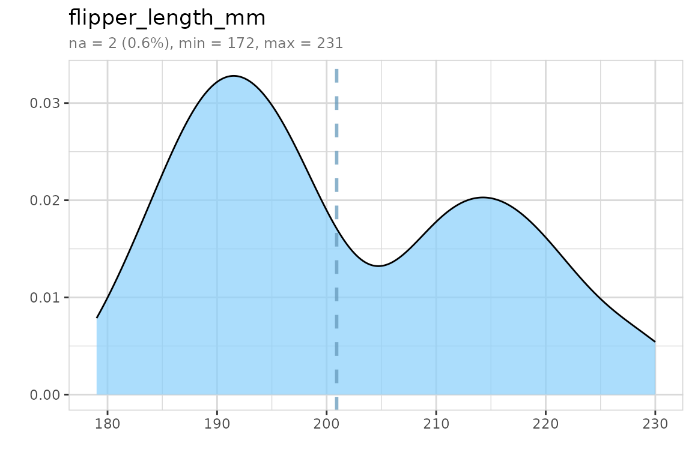
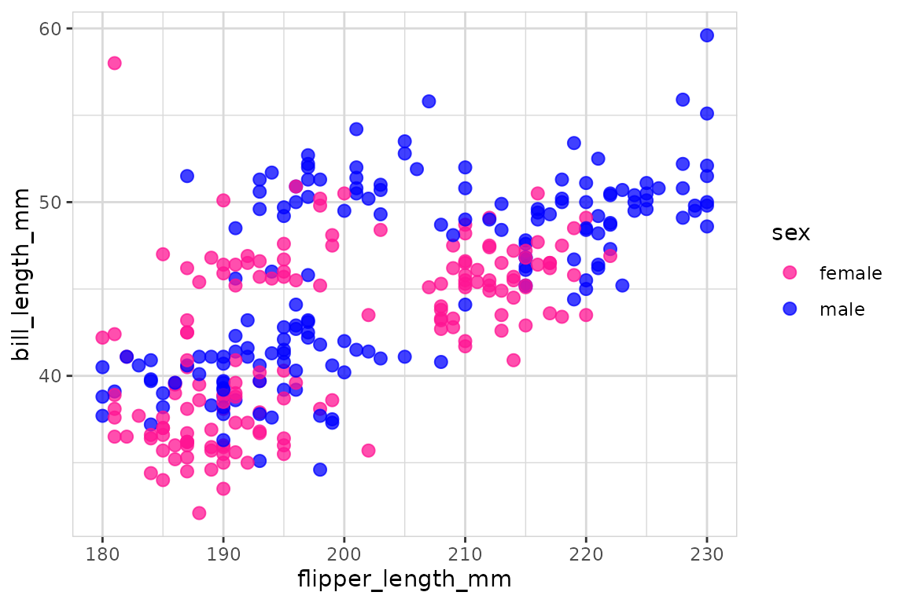
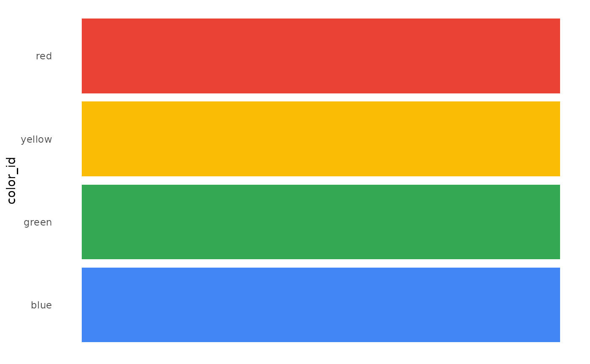

# Tips & tricks

``` r
library(dplyr)
library(explore)
```

## Count with percent

A classic [`count()`](https://dplyr.tidyverse.org/reference/count.html)
returns the number of observations.

``` r
data <- use_data_penguins()
data %>% count(island)
#> # A tibble: 3 × 2
#>   island        n
#>   <fct>     <int>
#> 1 Biscoe      168
#> 2 Dream       124
#> 3 Torgersen    52
```

To add percent values, simply use
[`count_pct()`](../reference/count_pct.md) from {explore}.

``` r
data %>% count_pct(island)
#> # A tibble: 3 × 4
#>   island        n total   pct
#>   <fct>     <int> <int> <dbl>
#> 1 Biscoe      168   344  48.8
#> 2 Dream       124   344  36.0
#> 3 Torgersen    52   344  15.1
```

## Add id

``` r
data %>% glimpse()
#> Rows: 344
#> Columns: 8
#> $ species           <fct> Adelie, Adelie, Adelie, Adelie, Adelie, Adelie, Adel…
#> $ island            <fct> Torgersen, Torgersen, Torgersen, Torgersen, Torgerse…
#> $ bill_length_mm    <dbl> 39.1, 39.5, 40.3, NA, 36.7, 39.3, 38.9, 39.2, 34.1, …
#> $ bill_depth_mm     <dbl> 18.7, 17.4, 18.0, NA, 19.3, 20.6, 17.8, 19.6, 18.1, …
#> $ flipper_length_mm <int> 181, 186, 195, NA, 193, 190, 181, 195, 193, 190, 186…
#> $ body_mass_g       <int> 3750, 3800, 3250, NA, 3450, 3650, 3625, 4675, 3475, …
#> $ sex               <fct> male, female, female, NA, female, male, female, male…
#> $ year              <int> 2007, 2007, 2007, 2007, 2007, 2007, 2007, 2007, 2007…
```

To add an id variable, simply use
[`add_var_id()`](../reference/add_var_id.md) from {explore}.

``` r
data %>% add_var_id() %>% glimpse()
#> Rows: 344
#> Columns: 9
#> $ id                <int> 1, 2, 3, 4, 5, 6, 7, 8, 9, 10, 11, 12, 13, 14, 15, 1…
#> $ species           <fct> Adelie, Adelie, Adelie, Adelie, Adelie, Adelie, Adel…
#> $ island            <fct> Torgersen, Torgersen, Torgersen, Torgersen, Torgerse…
#> $ bill_length_mm    <dbl> 39.1, 39.5, 40.3, NA, 36.7, 39.3, 38.9, 39.2, 34.1, …
#> $ bill_depth_mm     <dbl> 18.7, 17.4, 18.0, NA, 19.3, 20.6, 17.8, 19.6, 18.1, …
#> $ flipper_length_mm <int> 181, 186, 195, NA, 193, 190, 181, 195, 193, 190, 186…
#> $ body_mass_g       <int> 3750, 3800, 3250, NA, 3450, 3650, 3625, 4675, 3475, …
#> $ sex               <fct> male, female, female, NA, female, male, female, male…
#> $ year              <int> 2007, 2007, 2007, 2007, 2007, 2007, 2007, 2007, 2007…
```

## User defined report

Create a user defined report (RMarkdown template) to explore your own
data.

``` r
create_notebook_explore(
  output_dir = tempdir(),
  output_file = "notebook-explore.Rmd")
```

## Data Dictionary

Create a Data Dictionary of a data set (Markdown File data_dict.md)

``` r
iris  %>%  data_dict_md(output_dir = tempdir())
```

Add title, detailed descriptions and change default filename

``` r
description <- data.frame(
                  variable = c("Species"), 
                  description = c("Species of Iris flower"))
data_dict_md(iris, 
             title = "iris flower data set", 
             description =  description, 
             output_file = "data_dict_iris.md",
             output_dir = tempdir())
```

## Color

You can make your explore-plot more colorful

``` r
data <- use_data_penguins()
data |> explore(flipper_length_mm, color = "lightskyblue")
```



``` r
data |>
  drop_obs_with_na() |> 
  explore(flipper_length_mm, bill_length_mm, 
          target = sex, color = c("deeppink", "blue"))
```



You can even mix your own colors

``` r
colors <- mix_color("blue", n = 5)
colors
#> [1] "#AAAAFF" "#5555FF" "#0000FF" "#0000AA" "#000055"
```

``` r
show_color(colors)
```


``` r
colors <- mix_color("gold", "red", n = 4)
colors
#> [1] "#FFD700" "#FF8F00" "#FF4700" "#FF0000"
```

``` r
show_color(colors)
```


Or use some of the predefined colors in {explore}

``` r
get_color()
#> $a1
#> greylight       red      blue     black  greydark 
#> "#a3a9b0" "#d32c1c" "#5dbcd2" "#000000" "#868e96" 
#> 
#> $apple
#>     green    yellow    orange       red    violet      blue 
#> "#61bb46" "#fdb827" "#f5821f" "#e03a3e" "#963d97" "#009ddc" 
#> 
#> $google
#>      blue     green    yellow       red 
#> "#4285f4" "#34a853" "#fbbc05" "#ea4335" 
#> 
#> $mario
#>      mario      luigi      peach       toad     bowser donkeykong 
#>  "#e0102f"  "#08a936"  "#f096be"  "#17419a"  "#f8be10"  "#742607" 
#> 
#> $python
#>    yellow      blue      grey 
#> "#ffde57" "#4584b6" "#646464" 
#> 
#> $r
#>      blue 
#> "#2065b8" 
#> 
#> $redbull
#>    yellow       red      blue  bluedark 
#> "#ffc906" "#cc1e4a" "#223971" "#121f45" 
#> 
#> $slack
#>      blue       red    yellow     green    violet 
#> "#36c5f0" "#e01e5a" "#ecb22e" "#2eb67d" "#4a154b" 
#> 
#> $ubuntu
#>    orange  greydark greylight    violet 
#> "#dd4814" "#333333" "#aea79f" "#77216f"
```

``` r
colors <- get_color("google")
show_color(colors)
```



## Period yyyymm

This is how to calculate with periods (format yyyymm)

``` r
yyyymm_calc(202410, add_month = 3)
#> [1] 202501
```

``` r
yyyymm_calc(c(202408, 202409, 202410), add_month = -1, add_year = -1)
#> [1] 202307 202308 202309
```
