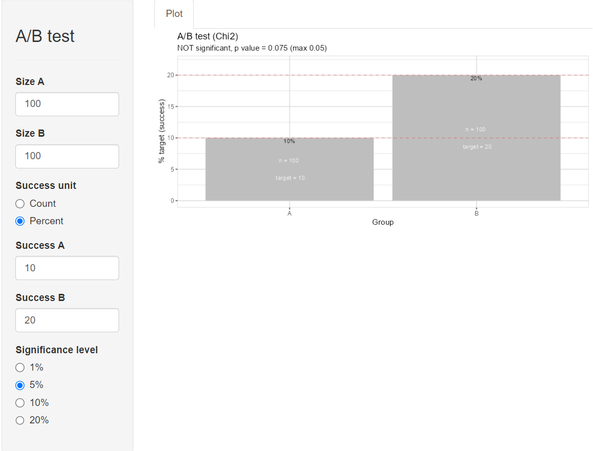

```{r setup, include = FALSE}
knitr::opts_chunk$set(
  collapse = TRUE,
  comment = "#>"
)
```

The explore package offers an easy way to do basic A/B testing.

### Interactive A/B testing

For interactive A/B testing simply call `abtest()` without any parameters.

{width=600px}

### A/B testing with tidy data

If you want to A/B test your own data, pass them into the ´abtest()´ function.

In this example we are using synthetic data using one of the `create_data_()` functions of `{explore}` 

```{r message=FALSE, warning=FALSE}
library(dplyr)
library(explore)
data <- create_data_buy(obs = 1000)
```

#### Describe dataset

```{r message=FALSE, warning=FALSE}
data %>% describe()
```

Each observation is a customer. The ´buy´ variable contains 0/1 values (1 = the customer did buy a product)

#### Hypothesis age > 50

We want to test the hypothesis, that customer with age > 50 have a different buying behavior.

```{r message=FALSE, warning=FALSE, fig.width=5}
data %>% explore(age, target = buy)
```

We see a clear pattern, that people who buy differ in age from people who don´t buy. But is this difference statistically significant?

```{r message=FALSE, warning=FALSE, fig.width=5}
data %>% abtest(age > 50, target = buy, sign_level = 0.05)
```

The A/B test shows a statistically significant difference!

#### Hypothesis Mobile Voice vs Broadband Usage

We would like to test the hypothesis, that customer with a mobile voice product (mobilevoice_ind == 1) have different bbi_usg_gb (broadband usage in GB)


```{r message=FALSE, warning=FALSE, fig.width=5}
data %>% explore(mobilevoice_ind, target = bbi_usg_gb)
```

The boxplot shows a small difference in Broadband Usage between customers with/without Mobile Voice product. But is this difference statistically significant?

```{r message=FALSE, warning=FALSE, fig.width=5}
data %>% abtest(mobilevoice_ind == 1, target = bbi_usg_gb, sign_level = 0.05)
```

The A/B test shows a NOT statistically significant difference! The p-value is 0.09, but should be max. 0.05 (as we defined sign_level = 0.05)

### A/B testing with count data

In this example we are using the Titanic datasst. `use_data_titanic()` is a functions of `{explore}` that makes it easier to use popular example datasets.

```{r message=FALSE, warning=FALSE}
library(dplyr)
library(explore)
data <- use_data_titanic(count = TRUE)
```

#### Describe dataset
 
```{r message=FALSE, warning=FALSE}
data %>% describe()
```

#### Hypothesis Female

We want to test the hypothesis, that female passengers have a higher chance to survive.

```{r message=FALSE, warning=FALSE, fig.width=5}
data %>% explore(Sex, target = Survived, n = n)
```

We see a clear pattern, but is it difference statistically significant?

```{r message=FALSE, warning=FALSE, fig.width=5}
data %>% abtest(Sex == "Female", target = Survived, n = n, sign_level = 0.05)
```

The A/B test shows a statistically significant difference!
