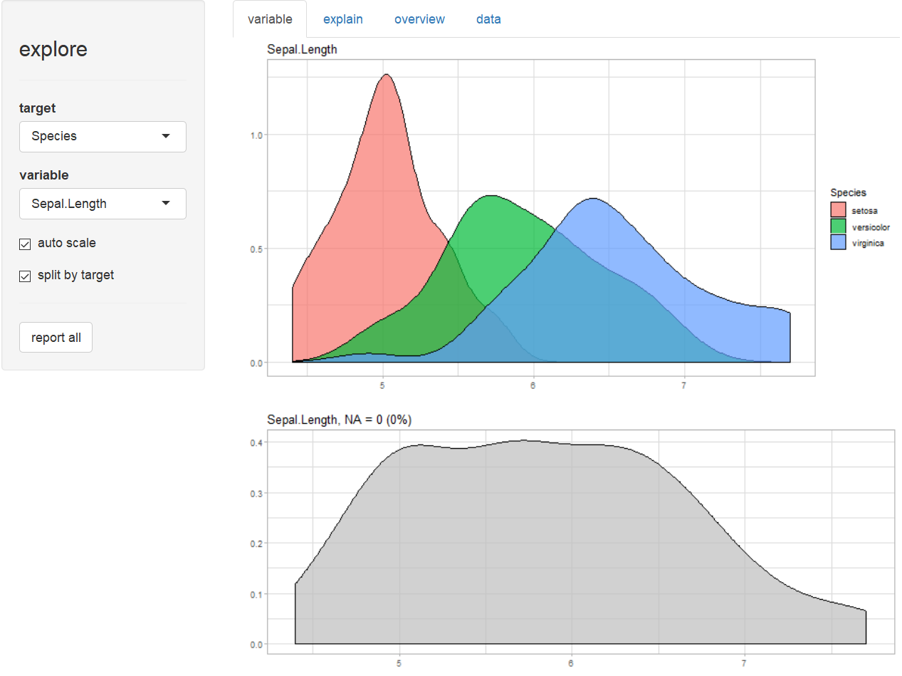
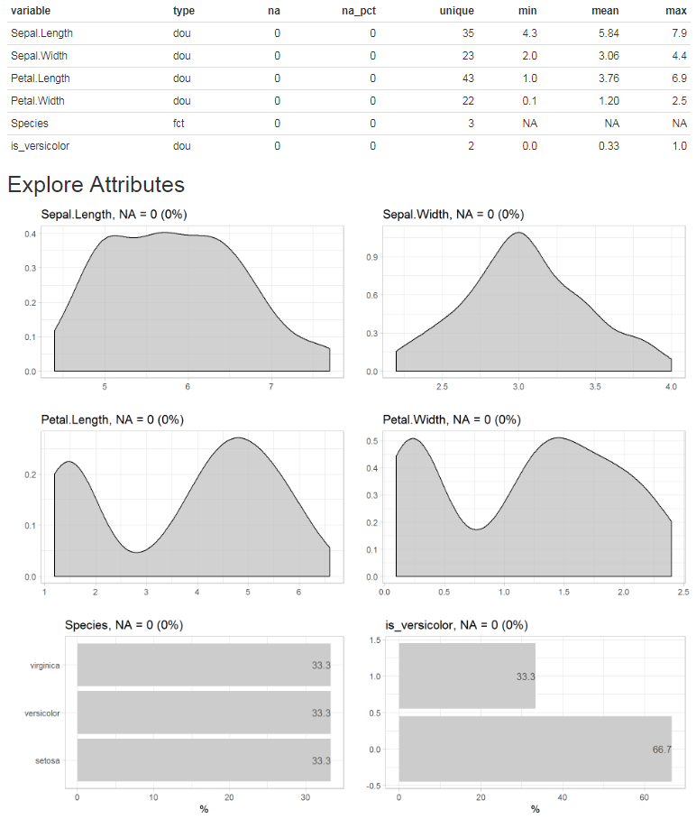

```{r setup, include = FALSE}
knitr::opts_chunk$set(
  collapse = TRUE,
  comment = "#>"
)
```

The explore package simplifies Exploratory Data Analysis (EDA). Get faster insights with less code!

There are three ways to use the package:

* **Interactive data exploration** (univariat, bivariat, multivariat)

* Generate an **Automated Report** with one line of code. The target can be binary, categorical or numeric. 

* **Manual exploration** using a easy to remember set of tidy functions. Introduces four main verbs. **explore()** to grafically explore a variable or table, **describe()** to describe a variable or table, **explain_tree() **to create a simple decision tree that explains a target. **report()** to generate an automated report of all variables.

explore package on Github: [https://github.com/rolkra/explore](https://github.com/rolkra/explore)

As the explore-functions fits well into the tidyverse, we load the dplyr-package as well.

```{r message=FALSE, warning=FALSE}
library(dplyr)
library(explore)
```

### Interactive data exploration

Explore your dataset (in this case the iris dataset) in one line of code:

```{R eval=FALSE, echo=TRUE}
explore(iris)
```

A shiny app is launched, you can inspect individual variable, explore their relation to a target (binary / categorical / numerical), grow a decision tree or create a fully automated report of all variables with a few "mouseclicks".
 
{width=600px}

You can choose each variable containng as a target, that is binary (0/1, FALSE/TRUE or "no"/"yes"), categorical or numeric.


### Report variables

Create a rich HTML report of all variables with one line of code:

```{R eval=FALSE, echo=TRUE}
# report of all variables
iris %>% report(output_file = "report.html", output_dir = tempdir())
```

{width=600px}

Or you can simply add a target and create the report. In this case we use a binary tharget, but a categorical or numerical target would work as well.

```{R eval=FALSE, echo=TRUE}
# report of all variables and their relationship with a binary target
iris$is_versicolor <- ifelse(iris$Species == "versicolor", 1, 0)
iris %>% 
  report(output_file = "report.html", 
         output_dir = tempdir(),
         target = is_versicolor)

```

If you use a binary tharget, the parameter ***split = FALSE*** will give you a different view on the data.

{width=600px}

### Grow a decision tree

Grow a decision tree with one line of code:

```{r message=FALSE, warning=FALSE, fig.width=6, fig.height=4}
iris %>% explain_tree(target = Species)
```

You can grow a decision tree with a binary target too.

```{r message=FALSE, warning=FALSE, fig.width=6, fig.height=4}
iris$is_versicolor <- ifelse(iris$Species == "versicolor", 1, 0)
iris %>% select(-Species) %>% explain_tree(target = is_versicolor)
```

Or using a numerical target. The syntax stays the same.

```{r message=FALSE, warning=FALSE, fig.width=6, fig.height=4}
iris %>% explain_tree(target = Sepal.Length)
```

You can control the growth of the tree using the parameters `maxdepth`, `minsplit` and `cp`.

### Explore dataset

Explore your table with one line of code to see which type of variables it contains.

```{r message=FALSE, warning=FALSE, fig.width=6, fig.height=3}
iris %>% explore_tbl()
```

You can also use describe_tbl() if you just need the main facts without visualisation.

```{r message=FALSE, warning=FALSE}
iris %>% describe_tbl()
```

### Explore variables

Explore a variable with one line of code. You don't have to care if a variable is numerical or categorical.

```{r message=FALSE, warning=FALSE, fig.width=6, fig.height=3}
iris %>% explore(Species)
```

```{r message=FALSE, warning=FALSE, fig.width=6, fig.height=3}
iris %>% explore(Sepal.Length)
```

### Explore variables with a target

Explore a variable and its relationship with a binary target with one line of code. You don't have to care if a variable is numerical or categorical.

```{r message=FALSE, warning=FALSE, fig.width=6, fig.height=3}
iris %>% explore(Sepal.Length, target = is_versicolor)
```

Using split = FALSE will change the plot to %target:

```{r message=FALSE, warning=FALSE, fig.width=6, fig.height=3}
iris %>% explore(Sepal.Length, target = is_versicolor, split = FALSE)
```

The target can have more than two levels:

```{r message=FALSE, warning=FALSE, fig.width=6, fig.height=3}
iris %>% explore(Sepal.Length, target = Species)
```

Or the target can even be numeric:

```{r message=FALSE, warning=FALSE, fig.width=6, fig.height=3}
iris %>% explore(Sepal.Length, target = Petal.Length)
```

### Explore multiple variables

```{r message=FALSE, warning=FALSE, fig.width=6, fig.height=2.5}
iris %>% 
  select(Sepal.Length, Sepal.Width) %>% 
  explore_all()
```

```{r message=FALSE, warning=FALSE, fig.width=6, fig.height=2.5}
iris %>% 
  select(Sepal.Length, Sepal.Width, is_versicolor) %>% 
  explore_all(target = is_versicolor)
```

```{r message=FALSE, warning=FALSE, fig.width=6, fig.height=2.5}
iris %>% 
  select(Sepal.Length, Sepal.Width, is_versicolor) %>% 
  explore_all(target = is_versicolor, split = FALSE)
```

```{r message=FALSE, warning=FALSE, fig.width=6, fig.height=2.5}
iris %>% 
  select(Sepal.Length, Sepal.Width, Species) %>% 
  explore_all(target = Species)
```

```{r message=FALSE, warning=FALSE, fig.width=6, fig.height=2.5}
iris %>% 
  select(Sepal.Length, Sepal.Width, Petal.Length) %>% 
  explore_all(target = Petal.Length)
```

```{r message=FALSE, warning=FALSE}
data(iris)
```

To use a high number of variables with explore_all() in a RMarkdown-File, it is necessary to set a meaningful fig.width and fig.height in the junk. The function total_fig_height() helps to automatically set fig.height: ```fig.height=total_fig_height(iris)```

```{r message=FALSE, warning=FALSE, fig.width=7, fig.height=total_fig_height(iris, size=2.5)}
iris %>% 
  explore_all()
```
If you use a target: ```fig.height=total_fig_height(iris, target = Species)```

```{r message=FALSE, warning=FALSE, fig.width=7, fig.height=total_fig_height(iris, target = Species, size=2.5)}
iris %>% explore_all(target = Species)
```

You can control total_fig_height() by parameters ncols (number of columns of the plots) and size (height of 1 plot)

### Explore correlation between two variables

Explore correlation between two variables with one line of code:

```{r message=FALSE, warning=FALSE, fig.width=6, fig.height=3}
iris %>% explore(Sepal.Length, Petal.Length)
```

You can add a target too:

```{r message=FALSE, warning=FALSE, fig.width=6, fig.height=3}
iris %>% explore(Sepal.Length, Petal.Length, target = Species)
```

### Other options

If you use explore to explore a variable and want to set lower and upper limits for values, you can use the `min_val` and `max_val` parameters. All values below min_val will be set to min_val. All values above max_val will be set to max_val.

```{r message=FALSE, warning=FALSE, fig.width=6, fig.height=3}
iris %>% explore(Sepal.Length, min_val = 4.5, max_val = 7)
```

`explore` uses auto-scale by default. To deactivate it use the parameter `auto_scale = FALSE`

```{r message=FALSE, warning=FALSE, fig.width=6, fig.height=3}
iris %>% explore(Sepal.Length, auto_scale = FALSE)
```

### Describing data

Describe your data in one line of code:

```{r message=FALSE, warning=FALSE, fig.width=6, fig.height=3}
iris %>% describe()
```

The result is a data-frame, where each row is a variable of your data. You can use `filter` from dplyr for quick checks:

```{r message=FALSE, warning=FALSE, fig.width=6, fig.height=3}
# show all variables that contain less than 5 unique values
iris %>% describe() %>% filter(unique < 5)
```

```{r message=FALSE, warning=FALSE, fig.width=6, fig.height=3}
# show all variables contain NA values
iris %>% describe() %>% filter(na > 0)
```

You can use `describe` for describing variables too. You don't need to care if a variale is numerical or categorical. The output is a text.

```{r message=FALSE, warning=FALSE, fig.width=6, fig.height=3}
# describe a numerical variable
iris %>% describe(Species)
```

```{r message=FALSE, warning=FALSE, fig.width=6, fig.height=3}
# describe a categorical variable
iris %>% describe(Sepal.Length)
```

### Data Dictionary

Create a Data Dictionary of a dataset (Markdown File data_dict.md)

```{R eval=FALSE, echo=TRUE}
iris %>% data_dict_md(output_dir = tempdir())
```

Add title, detailed descriptions and change default filename

```{R eval=FALSE, echo=TRUE}
description <- data.frame(
                  variable = c("Species"), 
                  description = c("Species of Iris flower"))
data_dict_md(iris, 
             title = "iris flower data set", 
             description =  description, 
             output_file = "data_dict_iris.md",
             output_dir = tempdir())
```

### Basic data cleaning

To clean a variable you can use `clean_var`. With one line of code you can rename a variable, replace NA-values and set a minimum and maximum for the value.

```{r message=FALSE, warning=FALSE, fig.width=6, fig.height=3}
iris %>% 
  clean_var(Sepal.Length, 
            min_val = 4.5, 
            max_val = 7.0, 
            na = 5.8, 
            name = "sepal_length") %>% 
  describe()
```

### Connecting to a datawarehouse

The explore package comes with a set easy to remember function to connect, read and write from/to a datawarehouse (dwh) using odbc.

```{R eval=FALSE, echo=TRUE}
# connect to a dwh(odbc DSN must be defined)
dwh <- dwh_connect("DWH_DSN")

# if you need to pass user and password
dwh <- dwh_connect("DWH_DSN", 
                    user = "myuser",
                    pwd = rstudioapi::askForPassword()
                  )

# read table from a dwh
data <- dwh_read_table(dwh, "db.tablename")

# read data from a dwh using sql
data <- dwh_read_data(dwh, sql = "select * from db.tablename")

# disconnect from dwh
dwh_disconnect(dwh)

```

To write large data to a dwh you can use `dwh_fastload()`. It connects to a dwh, writes the data and disconnects.

```{R eval=FALSE, echo=TRUE}
# connect to a dwh(odbc DSN must be defined)
data  %>% dwh_fastload("DWH_DSN", "db.tablename")
```
